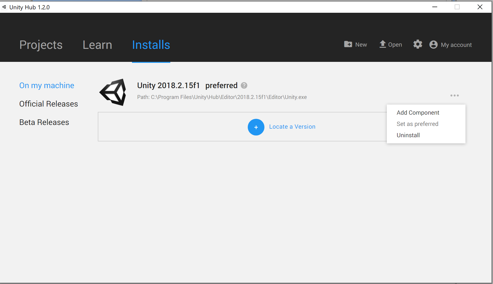
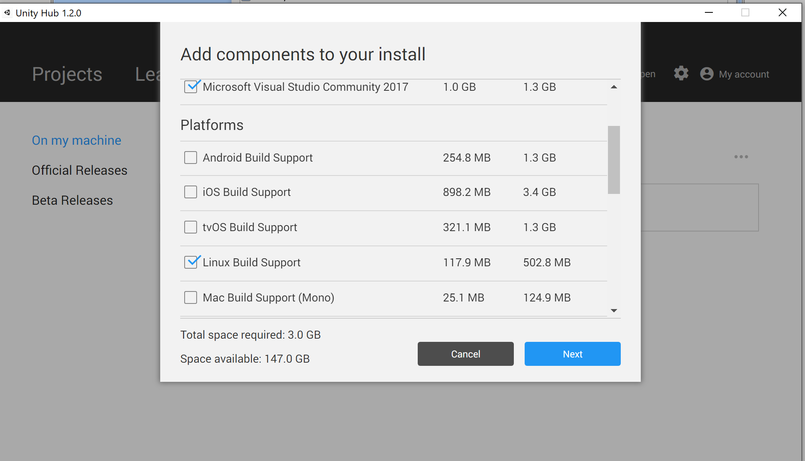

# AirSim 在 Unity 上

* AirSim 在 Unity 上允许您在 [Unity 引擎](https://unity3d.com/) 中运行模拟器。该项目包含一些示例 Unity 项目以及一个围绕 AirLib 库的封装，以便在 Unity 中作为 [原生插件](https://docs.unity3d.com/Manual/NativePlugins.html) 运行。
* 包含两个基本的 Unity 项目，一个是汽车模拟器，另一个是无人机模拟器。它们旨在轻量级，并可用于验证您的设置是否正确。
* 查看 [Unity 博客帖子](https://blogs.unity3d.com/2018/11/14/airsim-on-unity-experiment-with-autonomous-vehicle-simulation/) 以获取发布概述。

### 警告：实验性发布
该项目仍处于早期开发阶段，可能存在一些不太成熟之处。我们正在努力全面支持完整的 AirLib API 和功能集，但某些功能可能尚未实现。 [点击这里](unity_api_support.md) 查看当前支持的 API 列表。

## Windows
### 从源代码构建
#### 安装 Unity
* 从 [此页面](https://unity3d.com/get-unity/download) 下载 **Unity Hub**。
* 使用 Unity Hub 从 [这里](https://unity3d.com/get-unity/update?_ga=2.150316848.720992218.1588269226-65412882.1588269226) 安装 **Unity 2019.3.12**。 [详细说明在此处](https://docs.unity3d.com/Manual/GettingStartedInstallingHub.html)。
* 注意：如果您第一次使用 Unity，请查看 [入门指南](https://docs.unity3d.com/Manual/GettingStarted.html)。 [Unity 用户手册](https://docs.unity3d.com/Manual/UnityManual.html) 还包含额外的提示、资源和常见问题解答。

#### 构建 Airsim
* 安装 Visual Studio 2019。 
**确保**在安装 VS 2019 时选择 **C++ 桌面开发** 和 **Windows 10 SDK 10.0.18362**（默认应已选择）。

* 启动 `x64 Native Tools Command Prompt for VS 2019`。
* 克隆仓库：`git clone https://github.com/Microsoft/AirSim.git`，然后通过 `cd AirSim` 进入 AirSim 目录。
* 从命令行运行 `build.cmd`。

#### 构建 Unity 项目
* 进入 AirSim\Unity 目录：`cd Unity`。
* 构建 Unity 项目：`build.cmd`。
* 此外，您可以从 [Unity 资源商店](https://assetstore.unity.com/packages/3d/environments/roadways/windridge-city-132222) 下载免费的环境 `Windridge City`。当然，您也可以随时创建自己的环境。

## Linux
#### 依赖
```
sudo apt-get install libboost-all-dev
```
#### 下载并安装 Linux 的 Unity
<span style="color:red">警告：</span> Linux 的 Unity 编辑器仍处于测试阶段，可能存在一些不太成熟之处。

#### 安装 Unity
* 从 [此页面](https://unity3d.com/get-unity/download) 下载 **Unity Hub**。
* [使用 Unity Hub 安装 **Unity 2019.3.12**](https://docs.unity3d.com/Manual/GettingStartedInstallingHub.html)。
* 注意：如果您第一次使用 Unity，请查看 [入门指南](https://docs.unity3d.com/Manual/GettingStarted.html)。 [Unity 用户手册](https://docs.unity3d.com/Manual/UnityManual.html) 还包含额外的提示、资源和常见问题解答。

#### 构建 Airsim
```
git clone https://github.com/Microsoft/AirSim.git;
cd AirSim;
./setup.sh;
./build.sh
```

#### 生成 AirsimWrapper 共享库
```
cd AirSim/Unity
./build.sh
```

这将生成必要的共享库，并将其复制到 UnityDemo 插件文件夹中。

## 使用方法 
* 启动 Unity Hub，单击左侧面板上的 `Projects`，然后单击 `Add` 按钮。
* 选择文件夹 `AirSim\Unity\UnityDemo`，然后点击 `OK` 按钮。
* 单击 Unity Hub 菜单中出现的新项目以在 Unity 中打开它。
* 在底部面板中，单击 `Projects`->`Assets`->`Scenes`。然后，**双击** `SimModeSelector`。这将把 SimModeSelector 场景加载到场景层次面板中。 *不要* 将 CarDemo 或 DroneDemo 场景添加到场景层次面板中。
* 点击播放按钮以开始模拟（再次点击播放以停止模拟）。
* 另外，您也可以在 `Settings.json` 文件中更改 SimMode。（您可以在 [这里阅读更多关于 `Settings.json` 的信息](settings.md)）
* 控制汽车：    
使用 `WASD` 或 `方向键` 或 AirSim 客户端。   
* 控制无人机：    
目前无人机飞行不支持键盘控制。
* 更改相机视图：    
按键 `0`、`1`、`2`、`3` 用于切换不同相机视图的窗口。
* 记录模拟数据：    
按右下角的 *Record* 按钮（红色按钮），以切换记录模拟数据。记录的数据可以在 Windows 的 `Documents\AirSim\(录制日期)` 和 Linux 的 `~/Documents/AirSim/(录制日期)` 中找到。

## 为 AirSim 构建自定义环境
要使用除 `UnityDemo` 以外的环境，请按照 [此处](custom_unity_environments.md) 的说明进行操作。

## 交叉编译到 Linux
Unity 编辑器支持将项目编译到 Linux 系统。
在 Windows 上按照步骤构建 AirSim 和 Unity 后，请执行以下操作：

#### Linux 先决条件
在能够使用带有 Airsim 插件的 Unity 二进制文件运行之前，请务必按照上述 Linux 构建步骤在您的 Linux 机器上构建 airsim 和 airsim unity。

### 在 Windows 上打包 UnityDemo 二进制文件

#### 安装必要组件
为了将项目打包为 Linux，必须安装 **Linux Build Support** Unity 附加组件。
* 打开 **Unity Hub**，在您 **Unity 2018.2.15f1** 标签右侧的下拉窗口中点击 **Add component** 按钮。

* 确保选择 **Linux Build Support** 平台。

一旦该组件成功安装，您就可以为 Linux 构建 Unity 项目！

#### 构建项目
* 在您的 Windows 机器上，通过导航到工具栏中的构建设置选项 ```File -> Build Settings``` 构建 Unity Demo。
* 确保以下场景被选择为构建：
	1. SimModeSelector
	2. CarDemo
	3. DroneDemo
* 将目标操作系统设置为 Linux，并选择适合您系统的版本（x86 或 x86_64）。
* 点击 ```Build```。
* 将构建的项目以及生成的文件夹 ```"{project_name}_Data"``` 传输到您的 Linux 机器。

#### 将 AirsimWrapper 库复制到项目插件文件夹
* 在您的 Linux 机器上，导航到您的 AirSim 仓库，并在终端窗口中运行以下命令：
	```
	cp Unity/linux-build/libAirsimWrapper.so path/to/your/project/{project_name}_Data/Plugins/{os_version}
	```
这将生成必要的共享库以允许 Airsim 与 Unity 通信，并将其复制到项目二进制文件的插件文件夹中。

#### 运行项目二进制文件
* 打开终端并导航到您的项目目录。
* 将项目二进制文件设置为可执行文件：
```
chmod +x "{project_name}.{configuration}"
```
* 运行二进制文件
```
./{project_name}.{configuration}
```
### 使用 Airsim API
* 要快速开始使用汽车或无人机的 Python API，只需运行相应的 [`hello_car.py`](https://github.com/Microsoft/AirSim/blob/main/PythonClient/car/hello_car.py) 或 [`hello_drone.py`](https://github.com/Microsoft/AirSim/blob/main/PythonClient/multirotor/hello_drone.py) 脚本。
* AirSim C++ 和 Python API 的详细信息 [见此处](apis.md)。

### 致谢
* 无人机对象由用户 31415926 提供，来自 [sketchfab](https://sketchfab.com/models/055841df0fb24cd4abde06a91f7d360a)。其许可证为 [CC 许可证](https://creativecommons.org/licenses/by/4.0/)。