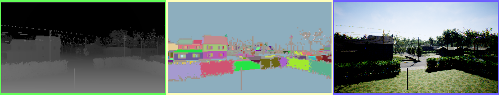
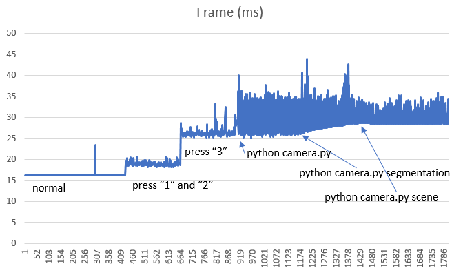
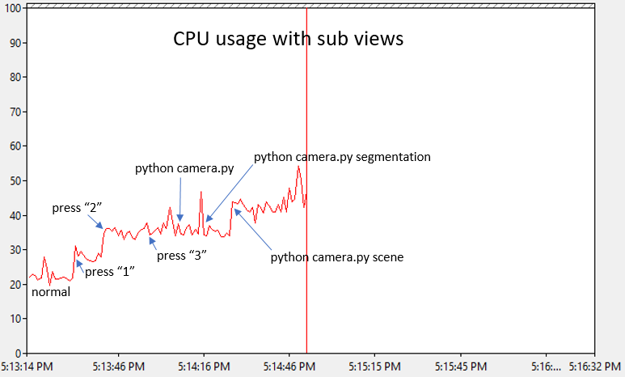

# 相机视图

屏幕上显示的相机视图就是你可以通过 [simGetImages API](image_apis.md) 获取的视图。



从左到右依次是深度视图、分割视图和第一人称视角（FPV）视图。详见 [图像 API](image_apis.md) 了解各种可用视图的描述。

## 开启/关闭视图

按下 F1 键可以查看用于开启/关闭任一或所有视图的快捷键。你还可以在此选择不同的视图模式，比如 "Fly with Me" 模式、FPV 模式 和 "Ground View" 模式。

## 控制手动相机

按下 M 键可以切换到手动相机控制模式。在该模式下，可以使用以下按键控制相机：

|键位|操作|
---|---
|方向键|控制相机前/后移动以及左右移动|
|Page Up / Page Down|控制相机上下移动|
|W / A / S / D|控制俯仰（Pitch）和偏航（Yaw）|
|左 Shift 键|增加移动速度|
|左 Ctrl 键|降低移动速度|

## 配置子窗口视图

你现在可以选择各个子窗口中显示的内容。例如，可以选择在第一个窗口中显示表面法线（而非深度图），在第二个窗口中显示视差图（而非分割图）。以下是在 [settings.json](settings.md) 中可使用的设置示例：

```

{
"SubWindows": \[
{"WindowID": 1, "CameraName": "0", "ImageType": 5, "VehicleName": "", "Visible": false},
{"WindowID": 2, "CameraName": "0", "ImageType": 3, "VehicleName": "", "Visible": false}
]
}

```

## 性能影响

*Note*: 本节内容已过时，尚未更新以反映最新的性能优化改动。

开启这些视图确实会影响游戏的 FPS 性能，因为这对 GPU 来说是额外的工作。下图展示了开启这些视图后对 FPS 的影响：



此数据是在一台配备 Intel i7 处理器、32GB 内存、GeForce GTX 1080 显卡的计算机上测试得出，场景为 Modular Neighborhood，使用已打包的调试版本运行，未开启调试器或 GameEditor。正常状态下（无子窗口开启）每帧耗时约 16 毫秒，维持在理想的 60 FPS（目标帧率）。当耗时上升至 35ms 时，帧率下降至约 28 FPS，达到 40ms 时会出现下降至 25 FPS 的情况。

尽管如此，即使在最差情况下模拟器仍然可以正常运行和飞行，因为物理引擎是与渲染解耦的。但是如果延迟过高，导致与 PX4 硬件的通信因 CPU 负载过重而中断，则可能会由于 offboard 控制消息超时导致飞行中断。

在进行该测试的计算机上，即使开启了所有视图，并运行了 3 个 Python 脚本分别捕获每种视图，drone 仍可顺利运行 path.py 程序。不过飞行过程中确实发生过一次中断，但系统能平稳恢复并完成飞行路径。因此性能基本处于临界值。

下图展示了对 CPU 的影响，可能令人意外的是，CPU 负载也非同小可：


