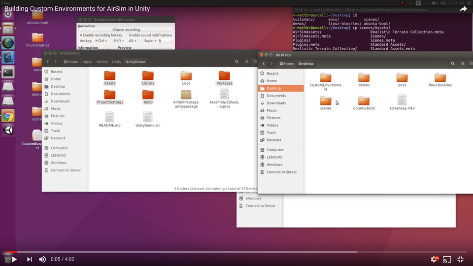
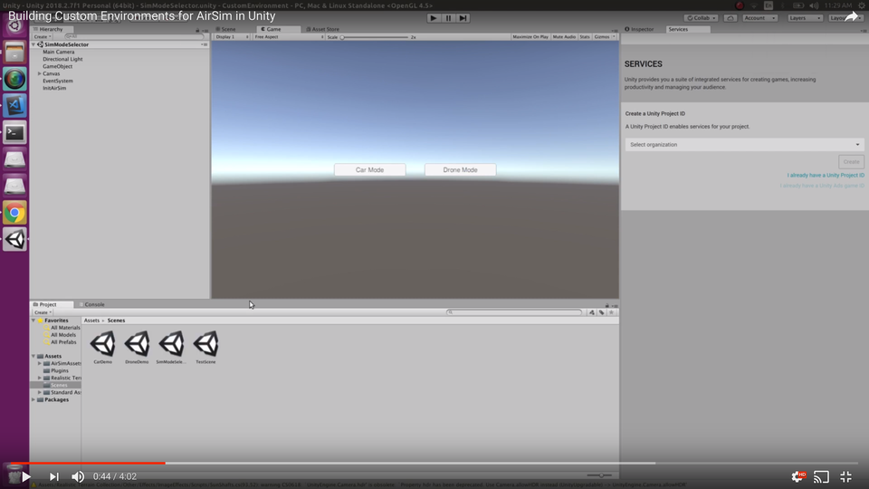

# 将 AirSim 添加到自定义 Unity 项目中
在完成以下步骤之前，请确保您已正确 [设置 AirSim for Unity](Unity.md)。

1. 打开自定义 Unity 项目的所在文件夹。
2. 从 Unity 演示中复制并粘贴以下项目到您自定义环境的主项目文件夹中：
```
Assets
ProjectSettings
```
[](https://youtu.be/5iplkEC88qw?start=5&end=12)

3. 在 Unity 中打开您的自定义环境。
4. 将您所需的场景拖入场景层级面板。
5. 将 CarDemo 拖入场景层级面板。
6. 从 CarDemo 中复制以下项目到您的自定义场景中：
```
Main Camera
Directional Light
AirSimHUD
AirSimGlobal
Car
```
7. 从层级面板中移除 `CarDemo` 后，将修改后的场景保存为 `CarDemo`。
[](https://youtu.be/5iplkEC88qw?start=45&end=78)
8. 对 `DroneDemo` 重复步骤 5、6 和 7。这次，将您的自定义场景保存为 `DroneDemo`。

要运行您的项目，请将 `SimModeSelector` 拖入场景层级面板，并移除面板中的其他所有项目。

您的自定义环境现在可以与 AirSim 进行接口连接了！