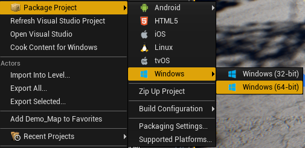

# 繁忙的硬盘

虽然不是必须的，但我们建议在固态硬盘（SSD）上运行你的 Unreal 环境。由于调试、记录和 Unreal 资源加载，硬盘可能成为你的瓶颈。虽然在 Unreal 加载环境时，硬盘会非常繁忙是正常的，但如果在 Unreal 游戏运行时你的硬盘性能表现得像这样，那你可能不会获得良好的飞行体验。

实际上，如果硬盘这么忙，凭经验来看，无人机可能根本无法正常飞行。出于某种未知原因，这个 I/O 瓶颈也会干扰无人机控制循环，如果该循环的运行频率不高（300-500 Hz），那么无人机将无法飞行。毫不奇怪，运行在 Pixhawk 飞行控制器上的 PX4 固件内部的控制循环运行频率为 1000 Hz。

### 减少 I/O

如果你这个周末无法去 Fry's Electronics 购买一个价格过高的超级快速 SSD，那么可以采取以下步骤来减少硬盘 I/O：

1. 首先，在 UE 编辑器或任何调试环境之外，使用烹饪内容运行 Unreal 环境，并将内容打包到你的最快 SSD 驱动器。你可以使用这个菜单选项进行操作：

   

2. 如果你必须使用 UE 编辑器（因为你正在主动修改游戏资源），那么至少不要在调试器中运行它。如果你正在使用 Visual Studio，请选择无调试启动。
3. 如果你必须调试应用程序，并且正在使用 Visual Studio 调试器，停止 Visual Studio 记录 Intellitrace 信息。  
   进入工具/选项/调试/Intellitrace，关闭主要复选框。
4. 关闭任何你的环境可能启用的 [Unreal Analytics](https://docs.unrealengine.com/latest/INT/Gameplay/Analytics/index.html)，特别是任何文件记录。

### 来自页面故障的 I/O

如果你的系统内存不足，可能会开始将内存分页到磁盘。如果你的操作系统启用了磁盘分页，请确保它分页到你的最快 SSD。或者如果你有足够的 RAM，可以完全禁用分页。实际上，如果你禁用分页后游戏停止工作，你可以确定你已经耗尽了 RAM。

显然，关闭任何其他不必要的应用程序也应该释放内存，以免出现内存不足的情况。

### 理想的运行性能

这是我在 UE 编辑器中飞行时慢硬盘的表现。你可以看到它非常繁忙，但无人机仍然飞得不错：

这是我在 Unreal 烹饪应用中飞行时快速 SSD 的表现（没有 UE 编辑器，没有调试器）。显然，在这种情况下它飞行得非常完美：

