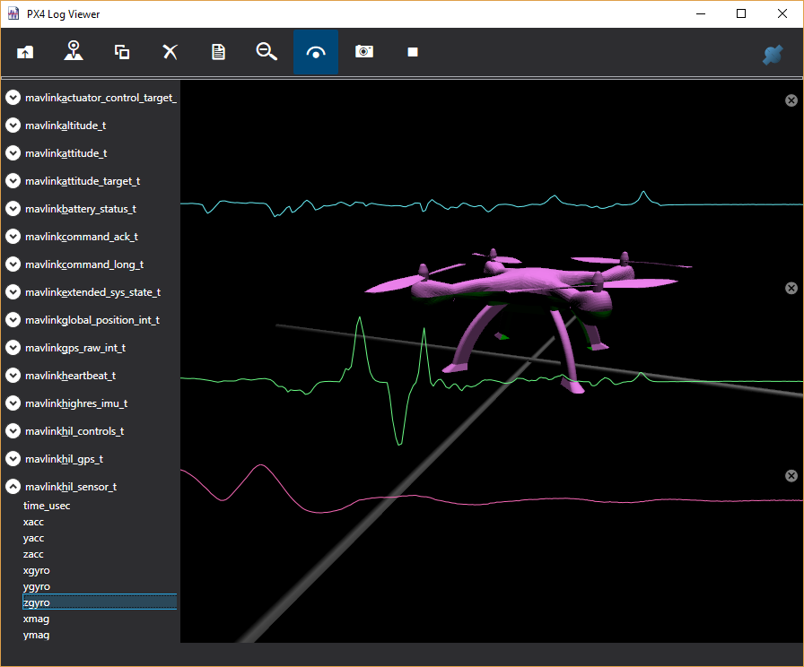

# 日志查看器

日志查看器是一个 Windows WPF 应用程序，展示了它从 Unreal Simulator 获取的 MavLink 流。您可以使用它来监控无人机飞行时发生的事情。例如，下面的图片显示了模拟器生成的 x、y 和 z 陀螺仪传感器信息的实时图表。

### 用法

您可以打开一个日志文件，它支持 .mavlink 和 PX4 *.ulg 文件，然后您将在左侧树视图中看到日志的内容。无论您选择哪个指标，都会添加到右侧。您可以通过每个图表右上角的小关闭框关闭每个单独的图表，并且可以使用顶部工具栏上的分组图表按钮将图表分组，以便它们共享相同的纵轴。



还有一个地图选项，可以绘制无人机的 GPS 路径。您还可以加载多个日志文件，以便比较它们之间的数据。

### 实时

如果在运行模拟之前连接日志查看器，您也可以得到实时视图。


为了使其正常工作，您需要使用以下设置配置 `settings.json`：
```
{
    "SettingsVersion": 1.2,
    "SimMode": "Multirotor",
    "Vehicles": {
        "PX4": {
            ...,
            "LogViewerHostIp": "127.0.0.1",
            "LogViewerPort": 14388,
        }
    }
}
```

注意：当您想要实时日志查看器记录时，请不要使用“日志”设置。使用“日志”记录到文件与日志查看器记录是相互排斥的。

只需按下窗口右上角的蓝色连接器按钮，选择 Socket `选项卡`，输入端口号码 `14388`，以及您的 `localhost` 网络。如果您在 Windows 上使用 WSL 2，请选择 `vEthernet (WSL)`。

如果您选择 `vEthernet (WSL)`，确保还将 `LocalHostIp` 和 `LogViewerHostIp` 设置为匹配的 WSL 以太网地址，类似于 `172.31.64.1`。

然后按下记录按钮（工具栏右侧的三角形）。现在启动模拟器，数据将开始流入日志查看器。

日志查看器中的无人机视图显示来自 PX4 的实际估计位置，因此这是检查 PX4 是否与模拟器同步的好方法。有时您可能会在这里看到一些漂移，因为姿态估计跟上现实，这在一次严重碰撞后可能会更加明显。

### 安装

如果您无法构建 LogViewer.sln，还有一个 [点击安装程序](https://lovettsoftwarestorage.blob.core.windows.net/downloads/Px4LogViewer/Px4LogViewer.application)。

### 配置

神奇的端口号 14388 可以通过编辑 [settings.json 文件](settings.md) 在模拟器中进行配置。如果您在日志查看器连接对话框中更改端口号，请确保在您的 `settings.json` 文件中进行相应的更改。

### 调试

有关如何使用日志查看器调试您设置的情况的更多信息，请参见 [PX4 Logging](px4_logging.md)。