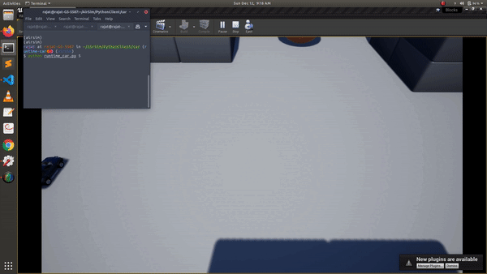

# AirSim中的多辆车

自1.2版本发布以来，AirSim完全支持多辆车。这一功能使得您可以轻松创建多辆车并使用API进行控制。

## 创建多辆车

只需在 [settings.json](settings.md) 中进行指定即可。`Vehicles` 元素允许您指定要创建的车辆列表及其初始位置和方向。位置以NED坐标表示，单位为SI，原点设置在虚幻环境中的Player Start组件。方向以度数表示的Yaw、Pitch和Roll。

### 创建多辆汽车

```json
{
	"SettingsVersion": 1.2,
	"SimMode": "Car",

	"Vehicles": {
		"Car1": {
		  "VehicleType": "PhysXCar",
		  "X": 4, "Y": 0, "Z": -2
		},
		"Car2": {
		  "VehicleType": "PhysXCar",
		  "X": -4, "Y": 0, "Z": -2,
      "Yaw": 90
		}
  }
}
```

### 创建多架无人机

```json
{
	"SettingsVersion": 1.2,
	"SimMode": "Multirotor",

	"Vehicles": {
		"Drone1": {
		  "VehicleType": "SimpleFlight",
		  "X": 4, "Y": 0, "Z": -2,
      "Yaw": -180
		},
		"Drone2": {
		  "VehicleType": "SimpleFlight",
		  "X": 8, "Y": 0, "Z": -2
		}
    }
}
```

## 使用API进行多辆车操作

自AirSim 1.2以来的新API允许您指定 `vehicle_name`。这个名称对应于json设置中的键（例如，上述的Car1或Drone2）。

[汽车的示例代码](https://github.com/microsoft/AirSim/blob/main/PythonClient/car/multi_agent_car.py)

[多旋翼的示例代码](https://github.com/microsoft/AirSim/blob/main/PythonClient/multirotor/multi_agent_drone.py)

使用多车的API需要指定 `vehicle_name`，该名称需要在脚本中硬编码或解析设置文件。此外，还有一个简单的API `listVehicles()`，返回一个包含当前车辆名称的字符串列表（C++中的向量）。例如，使用上述设置的2辆汽车 -

```python
>>> client.listVehicles()
['Car1', 'Car2']
```

### 演示

[](https://youtu.be/35dgcuLuF5M)

### 通过API在运行时创建车辆

在AirSim最新的主分支中，可以使用 `simAddVehicle` API在运行时创建车辆。这对于在不需要在设置中指定的情况下创建多辆这样的车辆非常有用。目前对此存在一些限制，具体如下 -

`simAddVehicle` 接受以下参数：

- `vehicle_name`：要创建的车辆名称，必须对每辆车唯一，包括在settings.json中定义的任何现有车辆
- `vehicle_type`：车辆类型，例如 "simpleflight"。目前仅支持SimpleFlight、PhysXCar、ComputerVision，其各自的SimModes。
  其他类型的车辆，包括与PX4和ArduPilot相关的，不受支持
- `pose`：车辆的初始姿态
- `pawn_path`：车辆蓝图路径，默认为空，使用车辆类型的默认蓝图

返回值：`bool` 是否创建了车辆

创建后，可以使用常规API通过 `vehicle_name` 参数控制和与车辆交互。目前无法指定其他设置，例如额外的摄像头等，未来可能会增强传递车辆设置的JSON字符串。它还与上述的 `listVehicles()` API一起工作，因此生成的车辆将包含在列表中。

要查看一些示例，请查看 [HelloSpawnedDrones.cpp](https://github.com/microsoft/AirSim/blob/main/HelloSpawnedDrones/HelloSpawnedDrones.cpp) -


以及 [runtime_car.py](https://github.com/microsoft/AirSim/tree/main/PythonClient/car/runtime_car.py) -

