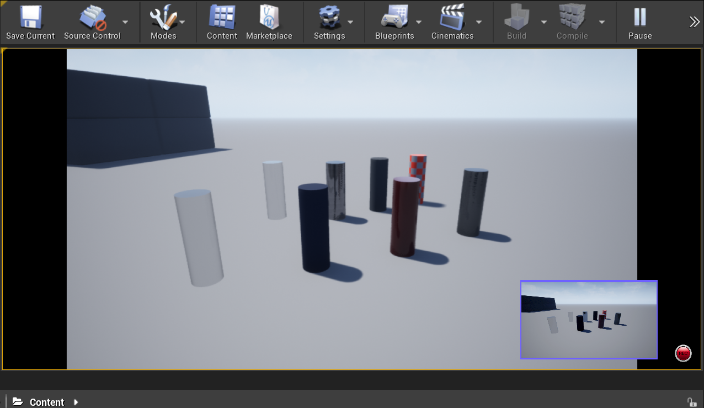
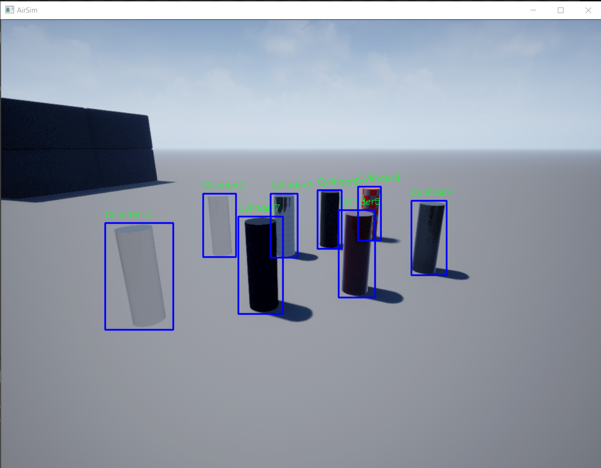

# 目标检测

## 介绍
此功能允许您使用 AirSim 中现有的相机生成目标检测，类似于检测 DNN。  
使用 API，您可以按名称和距离相机的半径控制要检测的对象。  
可以单独为每个相机、图像类型和车辆组合控制这些设置。

## API
- 以通配符格式设置要检测的网格名称   
```simAddDetectionFilterMeshName(camera_name, image_type, mesh_name, vehicle_name = '')```   

- 清除之前添加的所有网格名称   
```simClearDetectionMeshNames(camera_name, image_type, vehicle_name = '')```   

- 以厘米为单位设置检测半径   
```simSetDetectionFilterRadius(camera_name, image_type, radius_cm, vehicle_name = '')```   

- 获取检测结果   
```simGetDetections(camera_name, image_type, vehicle_name = '')```


`simGetDetections` 的返回值是一个 `DetectionInfo` 数组：
```python
DetectionInfo
    name = ''
    geo_point = GeoPoint()
    box2D = Box2D()
    box3D = Box3D()
    relative_pose = Pose()
```
## 使用示例
Python 脚本 [detection.py](https://github.com/microsoft/AirSim/blob/main/PythonClient/detection/detection.py) 显示如何设置检测参数，并在 OpenCV 捕获中显示结果。

一个使用 API 在 Blocks 环境中检测 Cylinder 对象的最小示例：
```python
camera_name = "0"
image_type = airsim.ImageType.Scene

client = airsim.MultirotorClient()
client.confirmConnection()

client.simSetDetectionFilterRadius(camera_name, image_type, 80 * 100) # 单位为 [cm]
client.simAddDetectionFilterMeshName(camera_name, image_type, "Cylinder_*") 
client.simGetDetections(camera_name, image_type)
detections = client.simClearDetectionMeshNames(camera_name, image_type)
```

输出结果：
```python
Cylinder: <DetectionInfo> {   'box2D': <Box2D> {   'max': <Vector2r> {   'x_val': 617.025634765625,
    'y_val': 583.5487060546875},
    'min': <Vector2r> {   'x_val': 485.74359130859375,
    'y_val': 438.33465576171875}},
    'box3D': <Box3D> {   'max': <Vector3r> {   'x_val': 4.900000095367432,
    'y_val': 0.7999999523162842,
    'z_val': 0.5199999809265137},
    'min': <Vector3r> {   'x_val': 3.8999998569488525,
    'y_val': -0.19999998807907104,
    'z_val': 1.5199999809265137}},
    'geo_point': <GeoPoint> {   'altitude': 16.979999542236328,
    'latitude': 32.28772183970703,
    'longitude': 34.864785008379876},
    'name': 'Cylinder9_2',
    'relative_pose': <Pose> {   'orientation': <Quaternionr> {   'w_val': 0.9929741621017456,
    'x_val': 0.0038591264747083187,
    'y_val': -0.11333247274160385,
    'z_val': 0.03381215035915375},
    'position': <Vector3r> {   'x_val': 4.400000095367432,
    'y_val': 0.29999998211860657,
    'z_val': 1.0199999809265137}}}
```


