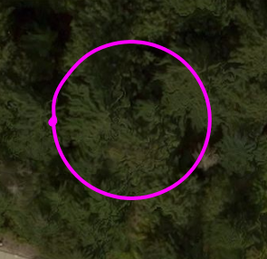

# 环绕轨迹

从 [https://github.com/microsoft/AirSim/wiki/An-Orbit-Trajectory](https://github.com/microsoft/AirSim/wiki/An-Orbit-Trajectory) 移动过来

你是否想过飞行一个平滑的圆形轨道？这对于从各个角度捕捉 3D 物体非常有用，尤其是当你在不同高度进行多个轨道飞行时。

因此，`PythonClient/multirotor` 文件夹包含一个名为 [Orbit](https://github.com/microsoft/AirSim/blob/main/PythonClient/multirotor/orbit.py) 的脚本，能够实现这一功能。

请查看 [演示视频](https://youtu.be/RFG5CTQi3Us)

演示视频是通过运行以下命令行生成的：

```shell
python orbit.py --radius 10 --altitude 5 --speed 1 --center "0,1" --iterations 1
```

这条命令使无人机在中心位置 (startpos + radius * [0,1]) 周围飞行一个半径为 10 米的轨道，换句话说，中心位置距离提供的中心向量  `radius` 米。它还让无人机的前置摄像头始终指向圆心。如果你使用 LogViewer 观看飞行，你会看到在 GPS 地图上描绘出一个漂亮的圆形轨迹：



算法的核心并不复杂。在圆上的每个点，我们向前看一小段用度数表示的增量，称为 `lookahead_angle`，这个角度是基于我们期望的速度计算的。然后，我们使用正弦/余弦找到圆上的这一前瞻点，并将其作为我们的“目标点”。随后，计算速度就变得简单，只需从当前的位置中减去该点，然后将结果输入 AirSim 的 `moveByVelocityZ` 方法即可。