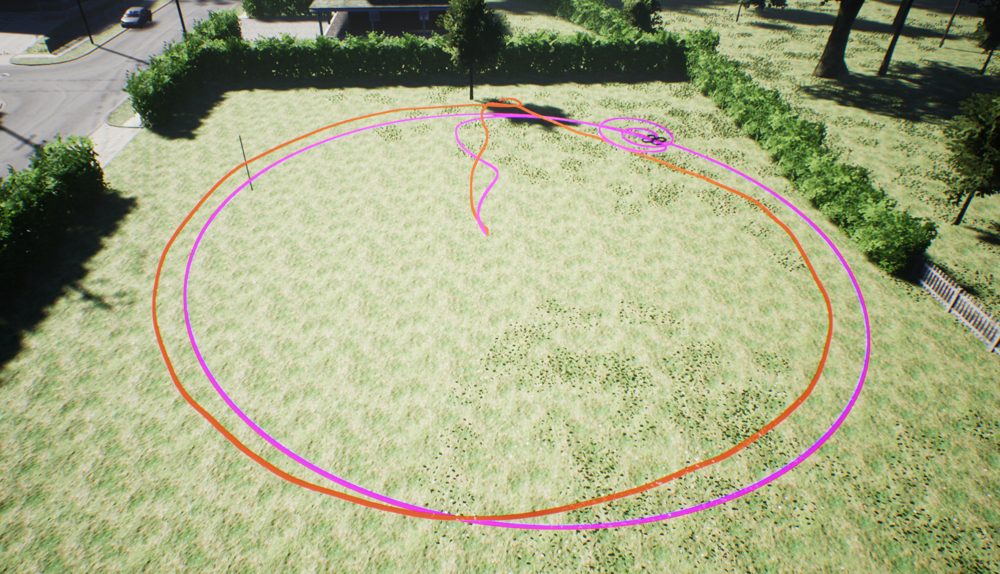

# 播放回放

AirSim 支持播放使用 MavLinkTest 应用程序录制的 *.mavlink 日志文件中的高层命令，以便比较真实飞行与模拟飞行。
[recording.mavlink](logs/recording.mavlink) 是一个示例日志文件，使用真实无人机通过以下命令行捕获：

```
MavLinkTest -serial:/dev/ttyACM0,115200 -logdir:. 
```

然后日志文件包含了执行的命令，其中包含几个“轨道”命令，飞行的 GPS 地图结果如下所示：


## 并排比较

现在我们可以将 MavLinkTest 记录的 *.mavlink 日志文件复制到运行 Unreal 模拟器并带有 AirSim 插件的 PC 上。
当模拟器运行且无人机停放在地图上的一个可以执行相同机动的地方时，我们可以运行以下 MavLinkTest 命令行：

```
MavLinkTest -server:127.0.0.1:14550
```

这应该会连接到模拟器。现在您可以输入以下命令：

```
PlayLog recording.mavlink
```
您在真实无人机上执行的相同命令现在将在模拟器中播放。您可以按下 't' 来查看轨迹，它将显示真实无人机和模拟无人机的轨迹。每次您再次按下 't'，您可以重置线条，以便与当前位置信步同步，这样我就能够捕捉到此录音中执行的“轨道”命令的并排轨迹，生成如下图像。粉色线是模拟飞行，红色线是实际飞行：



注意：我在模拟器中使用 ';' 键通过键盘控制相机位置以获取此镜头。

## 参数

设置模拟器时，有助于将其配置为与您的真实无人机使用的一些相同飞行参数，例如，我使用了低于正常巡航速度、慢速起飞速度，并且告诉模拟器在解除武装之前等待很长时间（COM_DISARM_LAND），并关闭安全开关 NAV_RCL_ACT 和 NAV_DLL_ACT（`不要`在真实无人机上执行此操作）。

```
param MPC_XY_CRUISE 2
param MPC_XY_VEL_MAX 2
param MPC_TKO_SPEED 1
param COM_DISARM_LAND 60
param NAV_RCL_ACT 0
param NAV_DLL_ACT 0
```