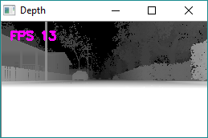
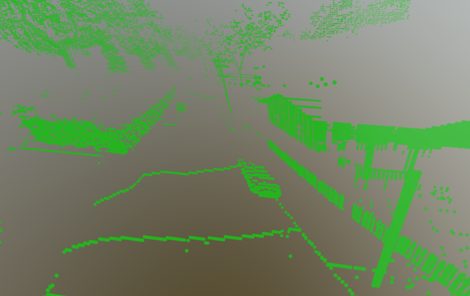

# 点云

移至此处，来自 [https://github.com/microsoft/AirSim/wiki/Point-Clouds](https://github.com/microsoft/AirSim/wiki/Point-Clouds)

一个 Python 脚本 [point_cloud.py](https://github.com/Microsoft/AirSim/blob/main/PythonClient/multirotor/point_cloud.py) 展示了如何将 AirSim 返回的深度图像转换为点云。

以下深度图像是使用 Modular Neighborhood 环境捕获的：

使用适当的投影矩阵，OpenCV 的 `reprojectImageTo3D` 函数可以将其转换为点云。以下是结果，您也可以在这里查看：[https://skfb.ly/68r7y](https://skfb.ly/68r7y)。

[SketchFab](https://sketchfab.com) 可以上传生成的文件 `cloud.asc` 并为您渲染。

PS：您可能会注意到场景在 Y 轴上的反射，因此我可能在投影矩阵的某个符号上犯了错误。留给读者的练习 :-)