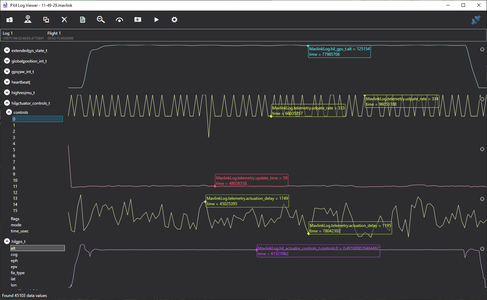

# PX4/MavLink 日志记录

感谢 [Chris Lovett](https://github.com/clovett) 开发的用于 PX4/MavLink 日志记录的各种工具，这些工具在本文中提到！

## 记录 MavLink 消息

如果您在 `settings.json` 文件的 PX4 部分添加以下内容，AirSim 可以捕获 mavlink 日志文件：

```json
{
    "SettingsVersion": 1.2,
    "SimMode": "Multirotor",
    "Vehicles": {
        "PX4": {
            ...,
            "Logs": "c:/temp/mavlink"
        }
    }
}
```

AirSim 将在该文件夹中为每次“武装/解除武装”飞行会话创建一个带时间戳的日志文件。

然后，您将在 d:\temp\logs 中看到按日期组织的日志文件，具体为 *input.mavlink 和 *output.mavlink 文件。

## MavLink LogViewer

对于启用 MavLink 的无人机，您还可以使用我们的 [Log Viewer](log_viewer.md) 可视化数据流。
如果您启用这种实时日志记录方式，您应该不要使用上面的“Logs”设置，这两种日志记录方式是互斥的。

## PX4 在 SITL 模式下的日志

在 SITL 模式下，无人机武装时会生成日志文件。SITL 终端将包含日志文件的路径，应该类似于这样：
```
INFO  [logger] Opened log file: rootfs/fs/microsd/log/2017-03-27/20_02_49.ulg
```

## PX4 在 HITL 模式下的日志

如果您在 HIL 模式下使用 Pixhawk 硬件，请使用 QGroundControl 设置参数 `SYS_LOGGER=1`。PX4 将在设备上写入日志文件，您可以在之后使用 QGroundControl 下载。

## 调试不良飞行

您可以使用这些 *.mavlink 日志文件使用 [LogViewer](log_viewer.md) 调试不良飞行。
例如，如果您在计算能力不足的计算机上运行 AirSim/PX4 飞行，可能会出现异常行为。
以下展示了在这种情况下可能发生的情况。


在这次飞行中，我们运行了一个简单的 `commander takeoff` 测试，执行者为 `PythonClient/multirotor/stability_test.py`，飞行开始时一切正常，但最后变得疯狂，导致无人机坠毁。那么这是怎么回事呢？日志文件能显示什么呢？

我们绘制了以下五个指标：
- `hil_gps.alt` - 从 AirSim 发送到 PX4 的模拟高度
- `telemetry.update_rate` - AirSim 进行关键无人机更新循环的更新率（每秒更新次数）
- `telemetry.update_time` - 在 AirSim 中执行关键无人机更新循环的平均时间
- `telemetry.actuation_delay` - 这是一个非常有趣的指标，测量 PX4 发送更新的执行器控制消息（电机功率）所需的时间
- `actuator_controls.0` - 从 PX4 获取的第一个转子的执行器控制信号

通过这些指标，我们观察到起初一切顺利，高度保持平稳，更新率处于 275 到 300 fps 范围内，AirSim 中的更新时间保持在 113 微秒左右，并且从 PX4 的往返延迟很低。执行器控制信号也迅速稳定在一条平坦的线。

但随后更新时间开始上升，与此同时，执行延迟也在上升，我们看到执行器控制出现小幅下滑。
这个下滑是不应该发生的，PX4 因更新率丢失而恐慌，但它恢复了。

然后我们看到执行器控制变得疯狂，执行延迟出现巨大峰值，同时我们收到来自 AirSim 的消息 `lockstep disabled`。超过 100 毫秒的延迟触发 AirSim 跳出锁步模式，PX4 失控，无人机坠毁。

关键是，如果一个简单的 `takeoff` 无法保持稳定平稳的飞行，并且您看到这些尖峰和不均匀的更新率，那么这意味着您在一个计算能力不足的计算机上运行 AirSim。

这就是一个简单起飞、悬停和着陆应该呈现的样子：



这里您可以看到 `update_rate` 保持在每秒 333 次更新的目标值。
您还可以看到 `update_time` 平稳在 39 微秒左右，以及 `actuator_delay` 在 1.1 毫秒到 1.7 毫秒之间，而结果 `actuator_controls` 则是一条完美的平坦线。