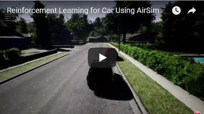
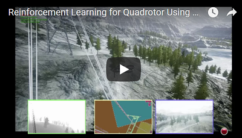

# AirSim中的强化学习

以下内容描述了如何使用围绕AirSim API的OpenAI gym包装器在AirSim中实现DQN，并使用stable baselines实现标准的强化学习算法。我们建议安装stable-baselines3以运行这些示例（请参见 https://github.com/DLR-RM/stable-baselines3）。

#### 声明

此内容仍在积极开发中。我们分享的框架可以扩展和调整以获得更好的性能。

#### Gym包装器

为了将AirSim用作gym环境，我们扩展并重新实现了基于AirSim和特定任务的基础方法，如 `step`、`_get_obs`、`_compute_reward` 和 `reset`。这些示例中用于汽车和无人机的样本环境可以在 `PythonClient/reinforcement_learning/*_env.py` 中看到。

## 汽车强化学习

[源代码](https://github.com/Microsoft/AirSim/tree/main/PythonClient/reinforcement_learning)

该示例适用于在 [releases](https://github.com/Microsoft/AirSim/releases) 中提供的AirSimNeighborhood环境。

首先，我们需要从仿真中获取图像并适当地转换它们。下面展示了如何从自我摄像头获取深度图像并将其转换为84X84的网络输入。（你可以使用其他传感器模式和传感器输入，当然你需要相应地修改代码）。

```
responses = client.simGetImages([ImageRequest(0, AirSimImageType.DepthPerspective, True, False)])
current_state = transform_input(responses)
```

我们进一步定义了六种动作（刹车、全速前进、全左转、全右转、半左转、半右转），代理可以执行这些动作。这是通过函数 `interpret_action` 实现的：

```
def interpret_action(action):
    car_controls.brake = 0
    car_controls.throttle = 1
    if action == 0:
        car_controls.throttle = 0
        car_controls.brake = 1
    elif action == 1:
        car_controls.steering = 0
    elif action == 2:
        car_controls.steering = 0.5
    elif action == 3:
        car_controls.steering = -0.5
    elif action == 4:
        car_controls.steering = 0.25
    else:
        car_controls.steering = -0.25
    return car_controls
```

接着我们在 `_compute_reward` 中定义奖励函数，作为车辆行驶速度和偏离中心线程度的凸组合。当代理快速移动并保持在车道中心时，获得高奖励。

```
def _compute_reward(car_state):
    MAX_SPEED = 300
    MIN_SPEED = 10
    thresh_dist = 3.5
    beta = 3

    z = 0
    pts = [np.array([0, -1, z]), np.array([130, -1, z]), np.array([130, 125, z]), np.array([0, 125, z]), np.array([0, -1, z]), np.array([130, -1, z]), np.array([130, -128, z]), np.array([0, -128, z]), np.array([0, -1, z])]
    pd = car_state.position
    car_pt = np.array(list(pd.values()))

    dist = 10000000
    for i in range(0, len(pts)-1):
        dist = min(dist, np.linalg.norm(np.cross((car_pt - pts[i]), (car_pt - pts[i+1])))/np.linalg.norm(pts[i]-pts[i+1]))

    #print(dist)
    if dist > thresh_dist:
        reward = -3
    else:
        reward_dist = (math.exp(-beta*dist) - 0.5)
        reward_speed = (((car_state.speed - MIN_SPEED)/(MAX_SPEED - MIN_SPEED)) - 0.5)
        reward = reward_dist + reward_speed

    return reward
```

奖励计算函数还会判断回合是否结束（例如由于碰撞）。我们观察车辆的速度，如果低于某个阈值，则认为回合结束。

```
done = 0
if reward < -1:
    done = 1
if car_controls.brake == 0:
    if car_state.speed <= 5:
        done = 1
return done
```

主循环依次获取图像、根据当前策略计算要采取的行动、获取奖励等等。如果回合结束，则通过 `reset()` 将车辆重置到原始状态：

```
client.reset()
client.enableApiControl(True)
client.armDisarm(True)
car_control = interpret_action(1) // 重置位置并直行一秒
client.setCarControls(car_control)
time.sleep(1)
```

一旦如 `car_env.py` 中定义的gym风格环境包装器建立，我们就可以利用stable-baselines3运行DQN训练循环。DQN训练配置如下所示，见于 `dqn_car.py`。

```
model = DQN(
    "CnnPolicy",
    env,
    learning_rate=0.00025,
    verbose=1,
    batch_size=32,
    train_freq=4,
    target_update_interval=10000,
    learning_starts=200000,
    buffer_size=500000,
    max_grad_norm=10,
    exploration_fraction=0.1,
    exploration_final_eps=0.01,
    device="cuda",
    tensorboard_log="./tb_logs/",
)
```

可以定义训练环境和评估环境（参见 `EvalCallback` 在 `dqn_car.py`）。评估环境可以与训练环境不同，具有不同的结束条件/场景配置。还定义了一个tensorboard日志目录作为DQN参数的一部分。最后，`model.learn()` 启动DQN训练循环。stable-baselines3也可以使用PPO、A3C等实现。

注意，执行 `dqn_car.py` 之前需要确保仿真正在运行。下面的视频展示了DQN训练的前几个回合。

[](https://youtu.be/fv-oFPAqSZ4)

## 四旋翼强化学习

[源代码](https://github.com/Microsoft/AirSim/tree/main/PythonClient/reinforcement_learning)

该示例适用于在 [releases](https://github.com/Microsoft/AirSim/releases) 中提供的AirSimMountainLandscape环境。

我们可以类似地将RL应用于各种无人机的自主飞行场景。下面是一个示例，展示了如何使用强化学习训练四旋翼沿高压电线飞行（例如，用于能源基础设施检查）。
这里有七个离散动作，对应于四旋翼可以移动的不同方向（六个方向 + 一种悬停动作）。

```
def interpret_action(self, action):
    if action == 0:
        quad_offset = (self.step_length, 0, 0)
    elif action == 1:
        quad_offset = (0, self.step_length, 0)
    elif action == 2:
        quad_offset = (0, 0, self.step_length)
    elif action == 3:
        quad_offset = (-self.step_length, 0, 0)
    elif action == 4:
        quad_offset = (0, -self.step_length, 0)
    elif action == 5:
        quad_offset = (0, 0, -self.step_length)
    else:
        quad_offset = (0, 0, 0)
```

奖励同样是基于四旋翼飞行速度与偏离已知电线的距离。

```
def compute_reward(quad_state, quad_vel, collision_info):
    thresh_dist = 7
    beta = 1

    z = -10
    pts = [np.array([-0.55265, -31.9786, -19.0225]),np.array([48.59735, -63.3286, -60.07256]),np.array([193.5974, -55.0786, -46.32256]),np.array([369.2474, 35.32137, -62.5725]),np.array([541.3474, 143.6714, -32.07256]),]

    quad_pt = np.array(list((self.state["position"].x_val, self.state["position"].y_val,self.state["position"].z_val,)))

    if self.state["collision"]:
        reward = -100
    else:
        dist = 10000000
        for i in range(0, len(pts) - 1):
            dist = min(dist, np.linalg.norm(np.cross((quad_pt - pts[i]), (quad_pt - pts[i + 1]))) / np.linalg.norm(pts[i] - pts[i + 1]))

        if dist > thresh_dist:
            reward = -10
        else:
            reward_dist = math.exp(-beta * dist) - 0.5
            reward_speed = (np.linalg.norm([self.state["velocity"].x_val, self.state["velocity"].y_val, self.state["velocity"].z_val,])- 0.5)
            reward = reward_dist + reward_speed
```

如果四旋翼偏离已知电线坐标太远，我们认为一次回合结束，然后将无人机重置到起点。

一旦如 `drone_env.py` 中定义的gym风格环境包装器建立，我们就可以利用stable-baselines3运行DQN训练循环。DQN训练可如下配置，见于 `dqn_drone.py`。

```
model = DQN(
    "CnnPolicy",
    env,
    learning_rate=0.00025,
    verbose=1,
    batch_size=32,
    train_freq=4,
    target_update_interval=10000,
    learning_starts=10000,
    buffer_size=500000,
    max_grad_norm=10,
    exploration_fraction=0.1,
    exploration_final_eps=0.01,
    device="cuda",
    tensorboard_log="./tb_logs/",
)
```

可以定义训练环境和评估环境（参见 `EvalCallback` 在 `dqn_drone.py`）。评估环境可以与训练环境不同，具有不同的结束条件/场景配置。还定义了一个tensorboard日志目录作为DQN参数的一部分。最后，`model.learn()` 启动DQN训练循环。stable-baselines3也可以使用PPO、A3C等实现。

以下是训练期间前几个回合的视频。

[](https://youtu.be/uKm15Y3M1Nk)

## 相关内容

请参见微软深度学习与机器人车库章节中的 [The Autonomous Driving Cookbook](https://aka.ms/AutonomousDrivingCookbook)。