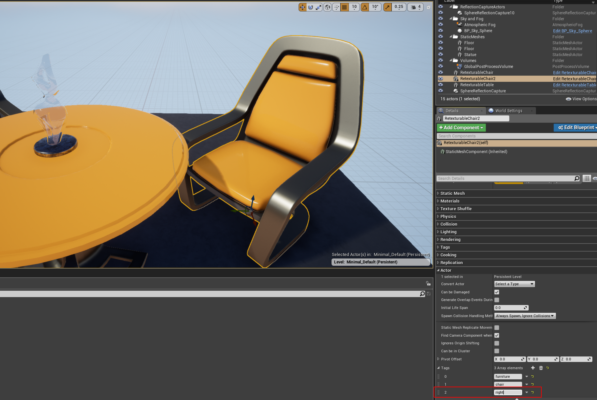

# 运行时纹理替换

## 如何使一个Actor可重纹理化

要使一个Actor具备纹理替换功能，该Actor必须继承自父类TextureShuffleActor。父类可以在Actor的蓝图设置选项卡中进行设置。


将父类设置为TextureShuffleActor后，对象将获得成员DynamicMaterial。DynamicMaterial需要在场景中所有Actor实例上设置为TextureSwappableMaterial。Warning: 在蓝图类中静态设置Dynamic Material可能会导致渲染错误。在场景中使用详细面板对所有Actor实例进行设置似乎更有效。


## 如何定义可选择的纹理集

通常，某些子集的Actor将共用一组纹理选项。（例如：同一栋建筑中的墙壁）

通过使用虚幻引擎的组编辑功能，设置这些分组非常简单。选择所有应具有相同纹理选择的实例，并通过详细面板同时将纹理添加到它们。使用相同的技术为一组Actor添加描述性标签，以便在API中进行引用。


理想的做法是从较大的分组到较小的分组，只需取消选择一部分Actor来缩小分组范围，并最后应用任何个别Actor属性。



## 如何通过API替换纹理

以下API可用于C++和Python。（显示为C++）

```C++
std::vector<std::string> simSwapTextures(const std::string& tags, int tex_id);
```

由逗号“,”或“， ”分隔的标签字符串确定在哪些Actor上执行替换。tex_id索引正在进行替换的每个Actor分配的纹理数组。如果某个对象的纹理集中的tex_id超出范围，则将根据可用纹理的数量取模。

演示（Python）：

```Python
import airsim
import time

c = airsim.client.MultirotorClient()
print(c.simSwapTextures("furniture", 0))
time.sleep(2)
print(c.simSwapTextures("chair", 1))
time.sleep(2)
print(c.simSwapTextures("table", 1))
time.sleep(2)
print(c.simSwapTextures("chair, right", 0))
```

结果：

```bash
['RetexturableChair', 'RetexturableChair2', 'RetexturableTable']
['RetexturableChair', 'RetexturableChair2']
['RetexturableTable']
['RetexturableChair2']
```


请注意，在这个例子中，对每个Actor选择了不同的纹理，尽管索引值相同。

您还可以使用`simSetObjectMaterial`和`simSetObjectMaterialFromTexture` APIs将对象的材质设置为任何材质资产或纹理的文件路径。有关使用这些API的更多信息，请参见[纹理API](apis.md#texture-apis)。