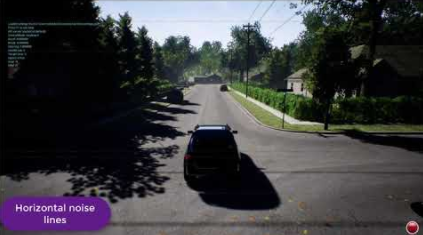

# AirSim 设置

## 设置存储位置在哪里？
AirSim 按照以下顺序搜索设置定义。第一个匹配的将被使用：

1. 查看 `-settings` 命令行参数指定的（绝对）路径。
   例如，在 Windows 中：`AirSim.exe -settings="C:\path\to\settings.json"`
   在 Linux 中 `./Blocks.sh -settings="/home/$USER/path/to/settings.json"`

2. 查找作为命令行参数传递的 json 文档，由 `-settings` 参数指定。
   例如，在 Windows 中：`AirSim.exe -settings={"foo":"bar"}`
   在 Linux 中 `./Blocks.sh -settings={"foo":"bar"}`

3. 在可执行文件的文件夹中查找名为 `settings.json` 的文件。
   这将是实际 Editor 或二进制文件存储的深层位置。
   例如，Blocks 二进制文件的搜索位置为 `<path-of-binary>/LinuxNoEditor/Blocks/Binaries/Linux/settings.json`。

4. 在可执行文件启动的文件夹中搜索 `settings.json`

    这是一个包含启动脚本或可执行文件的顶层目录。例如，Linux: `<path-of-binary>/LinuxNoEditor/settings.json`，Windows: `<path-of-binary>/WindowsNoEditor/settings.json`

    请注意，该路径根据从哪调用而变化。在 Linux 中，如果从 LinuxNoEditor 文件夹内执行 `Blocks.sh` 脚本，如 `./Blocks.sh`，则使用之前提到的路径。然而，如果从 LinuxNoEditor 文件夹外部启动，例如 `./LinuxNoEditor/Blocks.sh`，则使用 `<path-of-binary>/settings.json`。

5. 在 AirSim 子文件夹中查找名为 `settings.json` 的文件。AirSim 子文件夹在 Windows 中位于 `Documents\AirSim`，在 Linux 系统中位于 `~/Documents/AirSim`。

该文件采用常规 [json 格式](https://en.wikipedia.org/wiki/JSON)。在第一次启动时，AirSim 会在用户主文件夹中创建一个没有设置的 `settings.json` 文件。为避免问题，请始终使用 ASCII 格式保存 json 文件。

## 如何选择车辆和多旋翼？
默认使用多旋翼。要使用汽车，只需设置 `"SimMode": "Car"`，如下所示：

```json
{
  "SettingsVersion": 1.2,
  "SimMode": "Car"
}
```

要选择多旋翼，请设置 `"SimMode": "Multirotor"`。如果希望提示用户选择车辆类型，则使用 `"SimMode": ""`。

## 可用设置及其默认值
以下是可用设置的完整列表及其默认值。如果 json 文件中缺少任何设置，则使用默认值。一些默认值简单地指定为 `""`，这意味着实际值可能会根据您使用的车辆而选择。例如，`ViewMode` 设置的默认值为 `""`，这对于无人机转化为 `"FlyWithMe"`，对于汽车转化为 `"SpringArmChase"`。

**WARNING:** 请勿将以下内容全部复制粘贴到您的 settings.json 中。我们强烈建议仅添加您不希望使用默认值的设置。唯一的必需元素是 `"SettingsVersion"`。

```json
{
  "SimMode": "",
  "ClockType": "",
  "ClockSpeed": 1,
  "LocalHostIp": "127.0.0.1",
  "ApiServerPort": 41451,
  "RecordUIVisible": true,
  "LogMessagesVisible": true,
  "ShowLosDebugLines": false,
  "ViewMode": "",
  "RpcEnabled": true,
  "EngineSound": true,
  "PhysicsEngineName": "",
  "SpeedUnitFactor": 1.0,
  "SpeedUnitLabel": "m/s",
  "Wind": { "X": 0, "Y": 0, "Z": 0 },
  "CameraDirector": {
    "FollowDistance": -3,
    "X": NaN, "Y": NaN, "Z": NaN,
    "Pitch": NaN, "Roll": NaN, "Yaw": NaN
  },
  "Recording": {
    "RecordOnMove": false,
    "RecordInterval": 0.05,
    "Folder": "",
    "Enabled": false,
    "Cameras": [
        { "CameraName": "0", "ImageType": 0, "PixelsAsFloat": false,  "VehicleName": "", "Compress": true }
    ]
  },
  "CameraDefaults": {
    "CaptureSettings": [
      {
        "ImageType": 0,
        "Width": 256,
        "Height": 144,
        "FOV_Degrees": 90,
        "AutoExposureSpeed": 100,
        "AutoExposureBias": 0,
        "AutoExposureMaxBrightness": 0.64,
        "AutoExposureMinBrightness": 0.03,
        "MotionBlurAmount": 0,
        "TargetGamma": 1.0,
        "ProjectionMode": "",
        "OrthoWidth": 5.12
      }
    ],
    "NoiseSettings": [
      {
        "Enabled": false,
        "ImageType": 0,

        "RandContrib": 0.2,
        "RandSpeed": 100000.0,
        "RandSize": 500.0,
        "RandDensity": 2,

        "HorzWaveContrib":0.03,
        "HorzWaveStrength": 0.08,
        "HorzWaveVertSize": 1.0,
        "HorzWaveScreenSize": 1.0,

        "HorzNoiseLinesContrib": 1.0,
        "HorzNoiseLinesDensityY": 0.01,
        "HorzNoiseLinesDensityXY": 0.5,

        "HorzDistortionContrib": 1.0,
        "HorzDistortionStrength": 0.002
      }
    ],
    "Gimbal": {
      "Stabilization": 0,
      "Pitch": NaN, "Roll": NaN, "Yaw": NaN
    },
    "X": NaN, "Y": NaN, "Z": NaN,
    "Pitch": NaN, "Roll": NaN, "Yaw": NaN,
    "UnrealEngine": {
      "PixelFormatOverride": [
        {
          "ImageType": 0,
          "PixelFormat": 0
        }
      ]
    }
  },
  "OriginGeopoint": {
    "Latitude": 47.641468,
    "Longitude": -122.140165,
    "Altitude": 122
  },
  "TimeOfDay": {
    "Enabled": false,
    "StartDateTime": "",
    "CelestialClockSpeed": 1,
    "StartDateTimeDst": false,
    "UpdateIntervalSecs": 60
  },
  "SubWindows": [
    {"WindowID": 0, "CameraName": "0", "ImageType": 3, "VehicleName": "", "Visible": false, "External": false},
    {"WindowID": 1, "CameraName": "0", "ImageType": 5, "VehicleName": "", "Visible": false, "External": false},
    {"WindowID": 2, "CameraName": "0", "ImageType": 0, "VehicleName": "", "Visible": false, "External": false}
  ],
  "SegmentationSettings": {
    "InitMethod": "",
    "MeshNamingMethod": "",
    "OverrideExisting": true
  },
  "PawnPaths": {
    "BareboneCar": {"PawnBP": "Class'/AirSim/VehicleAdv/Vehicle/VehicleAdvPawn.VehicleAdvPawn_C'"},
    "DefaultCar": {"PawnBP": "Class'/AirSim/VehicleAdv/SUV/SuvCarPawn.SuvCarPawn_C'"},
    "DefaultQuadrotor": {"PawnBP": "Class'/AirSim/Blueprints/BP_FlyingPawn.BP_FlyingPawn_C'"},
    "DefaultComputerVision": {"PawnBP": "Class'/AirSim/Blueprints/BP_ComputerVisionPawn.BP_ComputerVisionPawn_C'"}
  },
  "Vehicles": {
    "SimpleFlight": {
      "VehicleType": "SimpleFlight",
      "DefaultVehicleState": "Armed",
      "AutoCreate": true,
      "PawnPath": "",
      "EnableCollisionPassthrogh": false,
      "EnableCollisions": true,
      "AllowAPIAlways": true,
      "EnableTrace": false,
      "RC": {
        "RemoteControlID": 0,
        "AllowAPIWhenDisconnected": false
      },
      "Cameras": {
        //same elements as CameraDefaults above, key as name
      },
      "X": NaN, "Y": NaN, "Z": NaN,
      "Pitch": NaN, "Roll": NaN, "Yaw": NaN
    },
    "PhysXCar": {
      "VehicleType": "PhysXCar",
      "DefaultVehicleState": "",
      "AutoCreate": true,
      "PawnPath": "",
      "EnableCollisionPassthrogh": false,
      "EnableCollisions": true,
      "RC": {
        "RemoteControlID": -1
      },
      "Cameras": {
        "MyCamera1": {
          //same elements as elements inside CameraDefaults above
        },
        "MyCamera2": {
          //same elements as elements inside CameraDefaults above
        },
      },
      "X": NaN, "Y": NaN, "Z": NaN,
      "Pitch": NaN, "Roll": NaN, "Yaw": NaN
    }
  },
  "ExternalCameras": {
    "FixedCamera1": {
        // same elements as in CameraDefaults above
    },
    "FixedCamera2": {
        // same elements as in CameraDefaults above
    }
  }
}
```

## SimMode
SimMode 决定将使用哪种仿真模式。以下是当前支持的值：
- `""`: 提示用户选择车辆类型，多旋翼或汽车
- `"Multirotor"`: 使用多旋翼仿真
- `"Car"`: 使用汽车仿真
- `"ComputerVision"`: 只使用相机，无车辆或物理

## ViewMode
ViewMode 决定默认使用哪个相机，以及相机将如何跟随车辆。对于多旋翼，默认的 ViewMode 是 `"FlyWithMe"`，而对于汽车，默认的 ViewMode 是 `"SpringArmChase"`。

* `FlyWithMe`: 从后面追逐车辆，具有 6 个自由度
* `GroundObserver`: 从离地面 6 英尺处追逐车辆，但在 XY 平面内具有完全自由度。
* `Fpv`: 从车辆的前置相机查看场景
* `Manual`: 不自动移动相机。使用箭头键和 ASWD 键手动移动相机。
* `SpringArmChase`: 使用固定在车辆上的（不可见）臂追逐车辆，通过弹簧连接（因此存在一定的移动延迟）。
* `NoDisplay`: 这会冻结主屏幕的渲染，然而子窗口、录制和 API 的渲染仍然处于活动状态。此模式在“无头”模式中非常有用，在这种情况下，您只关心获取图像，而不关心主屏幕上呈现的内容。这也可能提高录制图像的 FPS。

## TimeOfDay
此设置控制环境中太阳的位置。默认 `Enabled` 为 false，这意味着太阳的位置保持在环境中的默认状态，并且不会随着时间变化。如果 `Enabled` 为 true，则太阳的位置根据 `OriginGeopoint` 部分指定的经度、纬度和高度进行计算，并且日期在 `StartDateTime` 中以 [%Y-%m-%d %H:%M:%S](https://en.cppreference.com/w/cpp/io/manip/get_time) 字符串格式指定，例如，`2018-02-12 15:20:00` 。如果该字符串为空，则使用当前日期和时间。如果 `StartDateTimeDst` 为 true，则对夏令时进行调整。然后太阳的位置会在 `UpdateIntervalSecs` 指定的间隔中不断更新。在某些情况下，可能希望天体时钟运行的速度快于或慢于仿真时钟。可以使用 `CelestialClockSpeed` 指定，例如，值为 100 的意思是每经过 1 秒的仿真时钟，太阳的位置前进 100 秒，因此太阳在天空中的移动速度会更快。

另请参见 [Time of Day API](apis.md#time-of-day-api)。

## OriginGeopoint
此设置指定放置在 Unreal 环境中的玩家起始组件的纬度、经度和高度。车辆的家点是使用此转换计算的。请注意，通过 API 暴露的所有坐标均使用 NED 系统的 SI 单位，这意味着每辆车在 NED 系统中的起点为 (0, 0, 0)。时段设置是针对 `OriginGeopoint` 中指定的地理坐标进行计算的。

## SubWindows
此设置确定在按下 1、2、3 键时可见的三个子窗口中显示什么内容。

* `WindowID`: 可以是 0 至 2
* `CameraName`: 车辆上或外部相机上的任何 [可用相机](image_apis.md#available-cameras)
* `ImageType`: 整数值确定根据 [ImageType enum](image_apis.md#available-imagetype-values) 显示什么类型的图像。
* `VehicleName`: 字符串允许您指定使用相机的车辆，当在设置中指定多个车辆时使用。如果出现任何错误，例如车辆名称不正确，或仅有一辆车，将使用第一辆车辆的相机。
* `External`: 如果相机是外部相机，请设置为 `true`。如果为 true，则忽略 `VehicleName` 参数。

例如，对于单一汽车，以下展示驾驶员视图、前保险杠视图和后视图作为场景、深度和表面法线，分别如下所示。
```json
  "SubWindows": [
    {"WindowID": 0, "ImageType": 0, "CameraName": "3", "Visible": true},
    {"WindowID": 1, "ImageType": 3, "CameraName": "0", "Visible": true},
    {"WindowID": 2, "ImageType": 6, "CameraName": "4", "Visible": true}
  ]
```

在多个车辆的情况下，可以按以下方式指定不同的车辆 -

```json
    "SubWindows": [
        {"WindowID": 0, "CameraName": "0", "ImageType": 3, "VehicleName": "Car1", "Visible": false},
        {"WindowID": 1, "CameraName": "0", "ImageType": 5, "VehicleName": "Car2", "Visible": false},
        {"WindowID": 2, "CameraName": "0", "ImageType": 0, "VehicleName": "Car1", "Visible": false}
    ]
```

## 录制
录制功能允许您按指定间隔录制位置、方向、速度等数据以及捕获的图像。您可以通过按右下角的红色录制按钮或按 R 键开始录制。数据存储在 `Documents\AirSim` 文件夹中（或使用 `Folder` 指定的文件夹中），在每次录制会话的时间戳子文件夹中作为制表符分隔的文件。

* `RecordInterval`: 指定两幅图像之间捕获的最小间隔（以秒为单位）。
* `RecordOnMove`: 指定如果车辆的位置或方向没有变化，则不记录该帧。
* `Folder`: 创建具有时间戳的录制子文件夹的父文件夹。必须指定目录的绝对路径。如果不使用，则将使用 `Documents/AirSim` 文件夹。例如，`"Folder": "/home/<user>/Documents"`
* `Enabled`: 是否应从一开始就开始录制，将其设置为 `true` 将在仿真启动时自动开始录制。默认设置为 `false`
* `Cameras`: 该元素控制用于捕获图像的相机。默认情况下，从相机 0 录制场景图像，格式为压缩的 png。这一设置是 json 数组，您可以指定多个相机来捕获图像，每个相机可能具有不同的 [图像类型](settings.md#image-capture-settings)。
    * 当 `PixelsAsFloat` 为 true 时，图像以 [pfm](pfm.md) 文件格式保存，而不是 png 文件。
    * `VehicleName` 选项允许您为单独的车辆指定不同的相机。如果 `Cameras` 元素不存在，则将记录每辆车的默认相机的场景图像。
    * 如果您不想录制任何图像，只想录制车辆的物理数据，则指定 `Cameras` 元素但将其留空，如下所示：`"Cameras": []`
    * 当前不支持外部相机的录制。

例如，以下 `Cameras` 元素为 `Car1` 记录场景和分割图像，为 `Car2` 记录场景 -

```json
"Cameras": [
    { "CameraName": "0", "ImageType": 0, "PixelsAsFloat": false, "VehicleName": "Car1", "Compress": true },
    { "CameraName": "0", "ImageType": 5, "PixelsAsFloat": false, "VehicleName": "Car1", "Compress": true },
    { "CameraName": "0", "ImageType": 0, "PixelsAsFloat": false, "VehicleName": "Car2", "Compress": true }
]
```

有关如何修改录制的数据的详细信息，请查看 [Modifying Recording Data](modify_recording_data.md)。

## ClockSpeed
此设置允许您设置仿真时钟相对于墙壁时钟的速度。例如，值为 5.0 的意思是当墙壁时钟经过 1 秒时，仿真时钟经过 5 秒（即仿真运行得更快）。值为 0.1 意味着仿真时钟比墙壁时钟慢 10 倍。值为 1 意味着仿真以实时速度运行。重要的是要意识到，随着仿真时钟加速，仿真的质量可能会下降。您可能会看到一些伪影，例如物体在障碍物旁边移动，因为未检测到碰撞。然而，减慢仿真时钟（即值 < 1.0）通常会提高仿真的质量。

## 分割设置
`InitMethod` 决定如何在启动时初始化对象 ID 以生成 [分割](image_apis.md#segmentation)。值为 `""` 或 `"CommonObjectsRandomIDs"`（默认）意味着在启动时为每个对象分配随机 ID。这将生成使用随机颜色分配给每个对象的分割视图。值为 `"None"` 意味着不初始化对象 ID。这将导致分割视图具有单一的纯色。如果计划使用 [API](image_apis.md#segmentation) 设置对象 ID，这种模式将会大大减少大型环境（如 CityEnviron）的启动延迟。

如果 `OverrideExisting` 为 false，则初始化不会更改已经分配的非零对象 ID，否则会更改。

如果 `MeshNamingMethod` 为 `""` 或 `"OwnerName"`，则我们使用网格的所有者名称生成随机哈希作为对象 ID。如果为 `"StaticMeshName"`，则我们使用静态网格的名称生成随机哈希作为对象 ID。请注意，不能通过这种方式区分同一静态网格的单个实例，但是名称通常更直观。

## 风设置

此设置指定世界框架中的风速，以 NED 方向表示。值为 m/s。默认风速为 0，即无风。

## 相机导演设置

此元素指定用于在视口中跟随车辆的相机设置。

* `FollowDistance`: 相机跟随车辆的距离，默认负8（8 米）用于汽车，其它为 -3。
* `X, Y, Z, Yaw, Roll, Pitch`: 这些元素允许您指定相机相对于车辆的位置和方向。位置以 SI 单位的 NED 坐标表示，原点设置为 Unreal 环境中的玩家起始位置。方向以度为单位指定。

## 相机设置
根级别的 `CameraDefaults` 元素指定所有相机使用的默认值。这些默认值可以在 `Vehicles` 中的 `Cameras` 元素中覆盖，如下所述。

### 关于 ImageType 元素的说明
JSON 数组中的 `ImageType` 元素确定设置适用的图像类型。有效值在 [ImageType 部分](image_apis.md#available-imagetype) 中描述。此外，我们还支持特殊值 `ImageType: -1`，以将设置应用于外部相机（即您在屏幕上看到的内容）。

例如，`CaptureSettings` 元素是 json 数组，因此您可以轻松添加多个图像类型的设置。

### CaptureSettings
`CaptureSettings` 决定如何渲染不同的图像类型，例如场景、深度、视差、表面法线和分割视图。宽度、高度和 FOV 设置应该是显而易见的。`AutoExposureSpeed` 决定眼睛适应的速度。我们通常将其设置为较高的值，例如 100，以避免图像捕获中的伪影。类似地，我们将 `MotionBlurAmount` 默认设置为 0，以避免产生真实图像的伪影。`ProjectionMode` 决定捕获相机使用的投影，可以取值为 `"perspective"`（默认）或 `"orthographic"`。如果投影模式为 `"orthographic"`，则 `OrthoWidth` 决定以米为单位捕获的投影区域的宽度。

有关其他设置的解释，请参见 [这篇文章](https://docs.unrealengine.com/latest/INT/Engine/Rendering/PostProcessEffects/AutomaticExposure/)。

### 噪声设置
`NoiseSettings` 允许对指定图像类型添加噪声，目的是模拟相机传感器噪声、干扰和其他伪影。默认情况下未添加噪声，即 `Enabled: false`。如果您设置 `Enabled: true`，则会启用不同类型的噪声和干扰伪影，每种类型可以进一步调整。噪声效果是作为在 Unreal Engine 中创建的后处理材质以 Shader 的形式实现，称为 [CameraSensorNoise](https://github.com/Microsoft/AirSim/blob/main/Unreal/Plugins/AirSim/Content/HUDAssets/CameraSensorNoise.uasset)。

相机噪声和干扰模拟的演示：

[](https://youtu.be/1BeCEZmQyp0)

#### 随机噪声
这会添加随机噪声块，具有以下参数。
* `RandContrib`: 这决定了噪声像素与图像像素的混合比例，0 表示无噪声，1 表示仅噪声。
* `RandSpeed`: 这决定了噪声波动的速度，1 表示无波动，较高的值如 1E6 表示完全波动。
* `RandSize`: 这决定噪声的粗糙程度，1 表示每个像素都有自己的噪声，而较高的值表示超过 1 个像素共享相同的噪声值。
* `RandDensity`: 这决定总共有多少像素会有噪声，1 表示所有像素，而较高的值表示较少的像素（指数级）。

#### 水平波动失真
这会添加水平抖动/闪烁/鬼影效果。
* `HorzWaveContrib`: 这决定了噪声像素与图像像素的混合比例，0 表示无噪声，1 表示仅噪声。
* `HorzWaveStrength`: 这决定了效果的总体强度。
* `HorzWaveVertSize`: 这决定有多少垂直像素会受到该效果的影响。
* `HorzWaveScreenSize`: 这决定屏幕的多少部分会受到该效果的影响。

#### 水平噪声线
这会在水平线上添加噪声区域。
* `HorzNoiseLinesContrib`: 这决定了噪声像素与图像像素的混合比例，0 表示无噪声，1 表示仅噪声。
* `HorzNoiseLinesDensityY`: 这决定水平线中受影响的像素数量。
* `HorzNoiseLinesDensityXY`: 这决定屏幕上受影响的线条数量。

#### 水平线失真
这会在水平线上添加波动。
* `HorzDistortionContrib`: 这决定了噪声像素与图像像素的混合比例，0 表示无噪声，1 表示仅噪声。
* `HorzDistortionStrength`: 这决定失真的大小。

### 云台
`Gimbal` 元素允许冻结相机的俯仰、滚转和/或偏航方向。除非 `ImageType` 为 -1，否则将忽略该设置。`Stabilization` 的默认值为 0，意味着没有云台，即相机方向随车辆方向在所有轴上变化。值为 1 意味着完全稳定。在 0 到 1 之间的值作为权重用于固定角度（以度为单位，在世界框架内）和车辆机身的方向。当 json 中省略任意一个角度或设置为 NaN 时，该角度不稳定（即与车辆机身一起移动）。

### UnrealEngine
此元素包含特定于 Unreal Engine 的设置。这些在 Unity 项目中将被忽略。
* `PixelFormatOverride`: 这包含一个元素列表，其中有 `ImageType` 和 `PixelFormat` 设置。每个元素允许您覆盖用于通过 `ImageType` 设置捕获的 UTextureRenderTarget2D 对象的默认像素格式。指定此元素可以防止由于意外的像素格式导致的崩溃（参见 [#4120](https://github.com/microsoft/AirSim/issues/4120) 和 [#4339](https://github.com/microsoft/AirSim/issues/4339) 的崩溃示例）。可以在 [这里](https://docs.unrealengine.com/4.27/en-US/API/Runtime/Core/EPixelFormat/) 查看完整的像素格式列表。

## 外部相机
此元素允许指定与车辆连接的相机分开，例如 CCTV 相机。这些是固定相机，不会随车辆移动。元素中的键是相机的名称，而值（即设置）与上面描述的 `CameraDefaults` 相同。所有相机 API 都可以与外部相机一起使用，包括捕获图像、改变姿势等，通过在 API 调用中传递参数 `external=True`。

## 车辆设置
每种仿真模式会遍历此设置中指定的车辆列表，并创建 `"AutoCreate": true` 的车辆。此设置中指定的每辆车都有一个键，该键成为车辆的名称。如果缺少 `"Vehicles"` 元素，则该列表会填充名为 "PhysXCar" 的默认汽车和名为 "SimpleFlight" 的默认多旋翼。

### 通用车辆设置
- `VehicleType`: 这可以是以下任一类型 - `PhysXCar`、`SimpleFlight`、`PX4Multirotor`、`ComputerVision`、`ArduCopter` 和 `ArduRover`。没有默认值，因此必须指定此元素。
- `PawnPath`: 这允许覆盖要用于车辆的 pawn 蓝图。例如，您可以在自己的项目中从 ACarPawn 创建新的 pawn 蓝图，以替换 AirSim 中的默认汽车，并在此处指定其路径。另请参见 [PawnPaths](settings.md#PawnPaths)。请注意，您必须使用自己专有定义的对象名称在全局 `PawnPaths` 对象中指定自定义 pawn 蓝图类路径，并在 `Vehicles` 设置中引用该名称。例如，
```json
    {
      ...
      "PawnPaths": {
        "CustomPawn": {"PawnBP": "Class'/Game/Assets/Blueprints/MyPawn.MyPawn_C'"}
      },
      "Vehicles": {
        "MyVehicle": {
          "VehicleType": ...,
          "PawnPath": "CustomPawn",
          ...
        }
      }
    }
```
- `DefaultVehicleState`: 多旋翼的可能值为 `Armed` 或 `Disarmed`。
- `AutoCreate`: 如果为 true，则此车辆将被生成（如果所选仿真模式支持）。
- `RC`: 此子元素允许指定要为车辆使用的遥控器，使用 `RemoteControlID`。值为 -1 表示使用键盘（当前不支持多旋翼）。值 >= 0 表示系统连接的多个遥控器中的一个。在 Windows 的游戏控制器面板中可以看到可用的 RC 列表，例如。
- `X, Y, Z, Yaw, Roll, Pitch`: 这些元素允许您指定车辆的初始位置和方向。位置以 SI 单位的 NED 坐标表示，原点设置为 Unreal 环境中的玩家起始位置。方向以度为单位指定。
- `IsFpvVehicle`: 此设置允许指定哪个车辆相机将进行跟随，以及在 ViewMode 设置为 Fpv 时显示的视图。默认情况下，AirSim 选择设置中的第一个车辆作为 FPV 车辆。
- `Sensors`: 此元素指定与车辆关联的传感器，详见 [Sensors page](sensors.md)。
- `Cameras`: 此元素指定车辆的相机设置。此元素中的键是 [可用相机](image_apis.md#available_cameras) 的名称，值与上面描述的 `CameraDefaults` 相同。例如，若要将前中相机的 FOV 更改为 120 度，可以使用以下 `Vehicles` 设置：

```json
"Vehicles": {
    "FishEyeDrone": {
      "VehicleType": "SimpleFlight",
      "Cameras": {
        "front-center": {
          "CaptureSettings": [
            {
              "ImageType": 0,
              "FOV_Degrees": 120
            }
          ]
        }
      }
    }
}
```

### 使用 PX4
默认情况下，我们使用 [simple_flight](simple_flight.md)，因此您无需单独设置 HITL 或 SITL。我们还支持 ["PX4"](px4_setup.md) 供高级用户使用。要将 PX4 与 AirSim 一起使用，您可以在 `Vehicles` 设置中使用以下内容：

```
"Vehicles": {
    "PX4": {
      "VehicleType": "PX4Multirotor",
    }
}
```

#### 附加 PX4 设置

默认情况下，PX4 启用硬件环路设置。以下是 PX4 还有各种其他设置及其默认值：

```
"Vehicles": {
    "PX4": {
      "VehicleType": "PX4Multirotor",
      "Lockstep": true,
      "ControlIp": "127.0.0.1",
      "ControlPortLocal": 14540,
      "ControlPortRemote": 14580,
      "LogViewerHostIp": "127.0.0.1",
      "LogViewerPort": 14388,
      "OffboardCompID": 1,
      "OffboardSysID": 134,
      "QgcHostIp": "127.0.0.1",
      "QgcPort": 14550,
      "SerialBaudRate": 115200,
      "SerialPort": "*",
      "SimCompID": 42,
      "SimSysID": 142,
      "TcpPort": 4560,
      "UdpIp": "127.0.0.1",
      "UdpPort": 14560,
      "UseSerial": true,
      "UseTcp": false,
      "VehicleCompID": 1,
      "VehicleSysID": 135,
      "Model": "Generic",
      "LocalHostIp": "127.0.0.1",
      "Logs": "d:\\temp\\mavlink",
      "Sensors": {
        ...
      }
      "Parameters": {
        ...
      }
    }
}
```

这些设置定义了 MavLink 的 SystemId 和 ComponentId（SimSysID、SimCompID），以及车辆（VehicleSysID、VehicleCompID）的设置，并且允许从另一个应用程序进行远程控制，这被称为外部节点（OffboardSysID、OffboardCompID）。

如果希望仿真器将 mavlink 消息转发到地面控制应用程序（如 QGroundControl），您可以设置 UDP 地址，以防希望在不同的计算机上运行该应用程序（QgcHostIp、QgcPort）。默认情况下是本地计算机，因此如果 QGroundControl 运行在同一台计算机上，它应该“正常工作”。

您可以通过设置 UDP 地址将仿真器连接到此处提供的 LogViewer 应用程序（LogViewerHostIp、LogViewerPort）。

对于添加到仿真器的每个飞行无人机，都会有一组命名的附加设置。在上面您看到默认名称为 "PX4"。您可以在 Unreal 编辑器中更改此名称，当您添加新的 BP_FlyingPawn 资产时，您会看到这些属性在“属性”类别下分组。此 pawn 的 MavLink 节点可以通过 UDP 远程控制，或者可以连接到本地串口。如果是串口，则将 UseSerial 设置为 true，否则将 UseSerial 设置为 false。对于串口连接，您还需要设置适当的 SerialBaudRate。默认的 115200 与通过 USB 连接的 Pixhawk 版本 2 兼容。

当通过串口与 PX4 无人机通信时，HIL_* 消息和车辆控制消息共享同一个串口。当通过 UDP 或 TCP 进行通信时，PX4 需要两个单独的通道。如果 UseTcp 为 false，则使用 UdpIp、UdpPort 发送 HIL_* 消息，否则使用 TcpPort。PX4 中的 TCP 支持自 1.9.2 添加，带有 `lockstep` 特性，因为 TCP 提供的消息交付保证对于 lockstep 的正常运行是必需的。在这种情况下，AirSim 成为 TCP 服务器，并等待来自 PX4 应用程序的连接。控制车辆的第二个通道由 (ControlIp, ControlPort) 定义，并始终是 UDP 通道。

`Sensors` 部分可以为模拟传感器提供自定义设置，请参见 [Sensors](sensors.md)。`Parameters` 部分可以在初始化 PX4 连接时设置 PX4 参数。请参见 [设置 PX4 软件环路](px4_sitl.md) 的示例。

### 使用 ArduPilot

[ArduPilot](https://ardupilot.org/) 的 Copter 和 Rover 车辆在最新的 AirSim 主分支和版本 `v1.3.0` 及更高版本中得到支持。有关设置和使用方法，请参见 [ArduPilot SITL with AirSim](https://ardupilot.org/dev/docs/sitl-with-airsim.html)。

## 其他设置

### EngineSound
要关闭引擎声音，请使用 [设置](settings.md) `"EngineSound": false`。当前此设置仅适用于汽车。

### PawnPaths
这允许您指定自己的车辆蓝图，例如，您可以用自己的汽车替换 AirSim 中的默认汽车。您的车辆蓝图可以位于您自己 Unreal 项目的 Content 文件夹中（即在 AirSim 插件文件夹之外）。例如，如果您在项目中的 `Content\MyCar\MySedanBP.uasset` 文件中有一个汽车蓝图，则可以设置 `"DefaultCar": {"PawnBP":"Class'/Game/MyCar/MySedanBP.MySedanBP_C'"}`。`XYZ.XYZ_C` 是指定蓝图类所需的特殊表示法。请注意，您的蓝图必须基于 CarPawn 类。默认情况下不是这样，但您可以在打开蓝图后使用 UE 编辑器中的“类设置”按钮重新设置父类，然后在类选项中选择“Car Pawn”。还建议在蓝图详细信息中禁用“自动占用玩家”和“自动占用 AI”以及将 AI 控制器类设置为无。如果要创建二进制文件，请确保将您的资产包含在打包选项中。

### PhysicsEngineName
对于汽车，我们目前只支持 PhysX（无论该设置的值是什么）。对于多旋翼，我们支持 `"FastPhysicsEngine"` 和 `"ExternalPhysicsEngine"`。`"ExternalPhysicsEngine"` 允许通过 setVehiclePose() 控制无人机，在下一次调用之前保持无人机在原地。它在通过外部模拟器或在保存路径上移动 AirSim 无人机时特别有用。

### LocalHostIp 设置
现在在连接到远程计算机时，您可能需要选择特定的以太网适配器来访问这些计算机，例如，可能是通过以太网或 Wi-Fi，或者某些其他特殊的虚拟适配器或 VPN。您的 PC 可能有多个网络，这些网络可能不允许相互通信，在这种情况下，一个网络的 UDP 消息将无法传递到其他网络。

因此，LocalHostIp 允许您配置如何访问这些计算机。默认的 127.0.0.1 无法访问外部计算机，此默认值仅在与单台计算机上的所有内容进行通信时使用。

### ApiServerPort
此设置决定 AirSim 客户端使用的服务器端口，默认端口为 41451。
通过指定不同的端口，用户可以并行运行多个环境，以加速数据收集过程。

### SpeedUnitFactor
与 `m/s` 相关的速度单位换算因子，默认值为 1。与 SpeedUnitLabel 一起使用。这可能仅用于显示目的，例如在车辆行驶时的屏幕上显示速度。例如，要以 `miles/hr` 获取速度，请使用因子 2.23694。

### SpeedUnitLabel
速度的单位标签，默认值为 `m/s`。与 SpeedUnitFactor 一起使用。