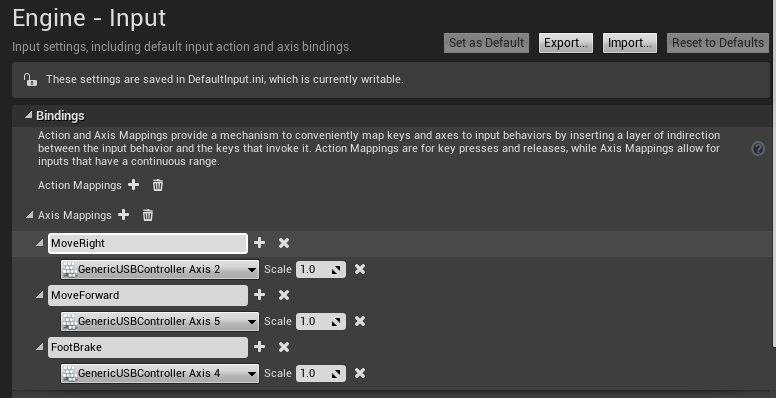

# Logitech G920 方向盘安装

要在 AirSim 中使用 Logitech G920 方向盘，请按照以下步骤操作：

1. 将方向盘连接到计算机，并等待驱动程序安装完成。

2. 从 [这里](http://support.logitech.com/en_us/software/lgs) 安装 Logitech Gaming Software。

3. 在调试之前，您需要在 AirSim 代码中归一化数值。请在 CarPawn.cpp 中进行以下更改（根据 git 中的当前更新）：  
   在第 382 行，将 “Val” 更改为 “1 – Val”。（在范围 [0.0,1.0] 中的互补值）。  
   在第 388 行，将 “Val” 更改为 “5Val - 2.5”（将给定输入的范围从 [0.0,1.0] 更改为 [-1.0,1.0]）。  
   在第 404 行，将 “Val” 更改为 “4(1 – Val)”。（在范围 [0.0,1.0] 中的互补值）。
 
4. 调试 AirSim 项目（确保方向盘已连接 - 这非常重要）。

5. 在 Unreal Editor 中，前往 Edit->Plugins->Input Devices 并启用 “Windows RawInput”。

6. 前往 Edit->Project Settings->Raw Input，添加新的设备配置：  
   Vendor ID: 0x046d （对于 Logitech G920，如果是其他设备，您可能需要检查）。  
   Product ID: 0xc261 （对于 Logitech G920，如果是其他设备，您可能需要检查）。  
   在 “Axis Properties” 下，确保 “GenericUSBController Axis 2”、“GenericUSBController Axis 4” 和 “GenericUSBController Axis 5” 都启用，并且偏移量为 1.0。  
   解释：轴 2 负责方向盘转动，轴 4 负责刹车，轴 5 负责油门。如果需要配置离合器，它在轴 3 上。
  
   

7. 前往 Edit->Project Settings->Input，在 “Axis Mappings” 下的 Bindings：  
   从 “MoveRight” 和 “MoveForward” 组删除现有映射。  
   向 “MoveRight” 组添加新的轴映射，使用 GenericUSBController 轴 2，比例为 1.0。  
   向 “MoveForward” 组添加新的轴映射，使用 GenericUSBController 轴 5，比例为 1.0。  
   添加一组新的轴映射，命名为 “FootBrake”，并向该组添加新的轴映射，使用 GenericUSBController 轴 4，比例为 1.0。
  
   
  
8. 开始游戏并驾驶！

### 注意事项

请注意，在调试后第一次“播放”时，我们需要触碰方向盘以“重置”数值。

### 提示

在游戏软件中，您可以将按钮配置为键盘快捷键，我们使用它来配置录制数据集或全屏播放的快捷键。