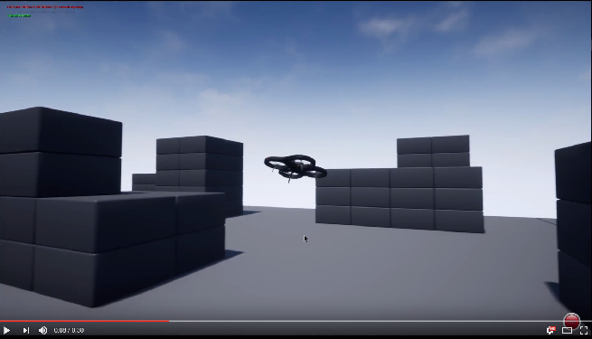

# 为 AirSim 设置 Blocks 环境

Blocks 环境在库的文件夹 `Unreal/Environments/Blocks` 中可用，设计成轻量级。这意味着它非常基础但运行快速。

以下是快速启动 Blocks 环境的步骤：

## Windows

1. 确保您已经 [安装了 Unreal 并构建了 AirSim](build_windows.md)。
2. 导航到文件夹 `AirSim\Unreal\Environments\Blocks`，双击 Blocks.sln 文件在 Visual Studio 中打开。默认情况下，该项目配置为 Visual Studio 2019。如果您想为 Visual Studio 2022 生成此项目，请在 Unreal 编辑器中转到 'Edit->Editor Preferences->Source Code'，将 'Source Code Editor' 设置为 'Visual Studio 2022'。
3. 确保 `Blocks` 项目是启动项目，构建配置设置为 `DebugGame_Editor` 和 `Win64`。按 F5 运行。
4. 在 Unreal 编辑器中按下播放按钮，您将看到类似于下面视频的内容。也请查看 [如何使用 AirSim](https://github.com/Microsoft/AirSim/#how-to-use-it)。

### 更改代码并重建
对于 Windows，您可以直接在 Visual Studio 中更改代码，按 F5 重新运行。文件夹 `AirSim\Unreal\Environments\Blocks` 中有几个批处理文件，可以让您同步代码、清理等。

## Linux
1. 确保您已经 [构建了 Unreal Engine 和 AirSim](build_linux.md)。
2. 导航到您的 UnrealEngine 库文件夹并运行 `Engine/Binaries/Linux/UE4Editor`，这将启动 Unreal 编辑器。
3. 在第一次启动时，您可能会在 UE4 编辑器中看不到任何项目。点击 Projects 选项卡，浏览按钮，然后导航到 `AirSim/Unreal/Environments/Blocks/Blocks.uproject`。
4. 如果系统提示不兼容的版本和转换，请选择就地转换，通常在 “More” 选项下。如果提示缺少模块，请确保选择 No，以便您不会退出。
5. 最后，当提示构建 AirSim 时，选择 Yes。现在可能会花费一些时间，所以去喝杯咖啡吧 :).
6. 在 Unreal 编辑器中按下播放按钮，您将看到类似于下面视频的内容。也请查看 [如何使用 AirSim](https://github.com/microsoft/AirSim/#how-to-use-it)。

### 更改代码并重建
对于 Linux，在 AirLib 或 Unreal/Plugins 文件夹中进行代码更改，然后运行 `./build.sh` 进行重建。此步骤还会将构建输出复制到 Blocks 示例项目。然后您可以再次按照上述步骤重新运行。

## 选择您的车辆：汽车或多旋翼
默认情况下，AirSim 生成多旋翼。您可以轻松将其更改为汽车，并使用 AirSim 的所有功能。请参阅 [使用汽车](using_car.md) 指南。

## FAQ
#### 我看到关于 "_BuiltData" 文件丢失的警告。
这些是中间文件，您可以安全地忽略它。