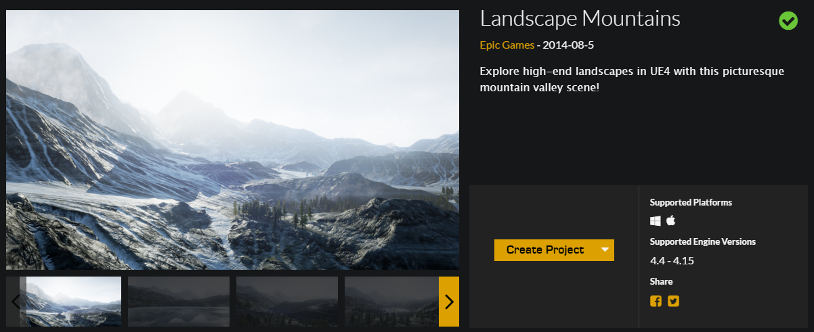
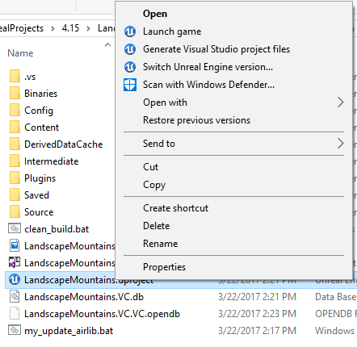

# 创建和设置 Unreal 环境
本页面包含从头到尾设置与 AirSim 配合使用的 Unreal 环境的完整说明。Unreal Marketplace 上有 [几种环境](https://www.unrealengine.com/marketplace/content-cat/assets/environments) 可供使用，只需几分钟即可开始。也可以使用 [turbosquid.com](https://www.turbosquid.com/) 或 [cgitrader.com](https://www.cgtrader.com/) 等网站提供的环境，但需要更多的努力（这是 [教程视频](https://www.youtube.com/watch?v=y09VbdQWvQY&feature)）。此外，还有几个 [免费的环境](https://github.com/Microsoft/AirSim/issues/424) 可用。

下面我们将使用从 Unreal Marketplace 下载的免费环境 Landscape Mountain，但任何其他环境的步骤都是相同的。

## 针对 Linux 用户的提示
Linux 上没有 `Epic Games Launcher`，这意味着如果您需要创建自定义环境，您将需要使用 Windows 机器来完成。一旦您有了 Unreal 项目文件夹，只需将其复制到 Linux 机器上即可。

## 逐步说明

1. 确保按照 [构建说明](build_windows.md) 构建了 AirSim 且安装了 Unreal 4.27。
2. 在 `Epic Games Launcher` 中点击学习标签，然后向下滚动找到 `Landscape Mountains`。点击 `Create Project` 以下载该内容（约 2GB）。

    

3. 打开 `LandscapeMountains.uproject`，这将启动 Unreal Editor。

    
    
    !!!note

        Landscape Mountains 项目支持到 Unreal Engine 版本 4.24。如果您没有安装 4.24，会看到一个标题为 `Select Unreal Engine Version` 的对话框，可以从已安装的版本中选择。选择 4.27 或更高版本以将项目迁移到受支持的引擎版本。如果您已安装 4.24，可以通过在 Windows 资源管理器中导航到相应的 .uproject 文件，右键点击并选择 `Switch Unreal Engine version...` 选项手动迁移项目。

4. 在 `File menu` 中选择 `New C++ class`，将类的类型默认设置为 `None`，点击 `Next`，将名称默认设置为 `MyClass`，然后点击 `Create Class`。我们需要这样做，因为 Unreal 至少需要一个源文件在项目中。这将触发编译并打开 Visual Studio 解决方案 `LandscapeMountains.sln`。

5. 前往您的 AirSim 仓库文件夹，并将 `Unreal\Plugins` 文件夹复制到 `LandscapeMountains` 文件夹中。这样，您自己的 Unreal 项目就有了 AirSim 插件。

    !!!note

        如果 AirSim 的安装是全新的，即之前没有构建过，确保您在复制 `Unreal\Plugins` 文件夹之前从根目录运行一次 `build.cmd`，以确保 `AirLib` 文件也被包括。如果您对 Blocks 环境做过一些更改，请确保从 `Unreal\Environments\Blocks` 运行 `update_to_git.bat` 来更新 `Unreal\Plugins` 中的文件。

6. 编辑 `LandscapeMountains.uproject` 文件，使其看起来像这样：

    ```json
    {
    	"FileVersion": 3,
    	"EngineAssociation": "4.27",
    	"Category": "Samples",
    	"Description": "",
    	"Modules": [
    		{
    			"Name": "LandscapeMountains",
    			"Type": "Runtime",
    			"LoadingPhase": "Default",
    			"AdditionalDependencies": [
    				"AirSim"
    			]
    		}
    	],
    	"TargetPlatforms": [
    		"MacNoEditor",
    		"WindowsNoEditor"
    	],
    	"Plugins": [
    		{
    			"Name": "AirSim",
    			"Enabled": true
    		}
    	]
    }
    ```
    
7. 编辑 `Config\DefaultGame.ini`，在最后添加以下行：

    ```
    +MapsToCook=(FilePath="/AirSim/AirSimAssets")
    ```
    
    这样做会强制 Unreal 在您的项目的打包构建中包含所有必要的 AirSim 内容。

8. 关闭 Visual Studio 和 `Unreal Editor`，然后在 Windows 资源管理器中右键点击 LandscapeMountains.uproject 并选择 `Generate Visual Studio Project Files`。此步骤会检测您 Unreal 项目中的所有插件和源文件并生成 `.sln` 文件供 Visual Studio 使用。

    

    !!!tip

        如果缺少 `Generate Visual Studio Project Files` 选项，您可能需要重启计算机以使 Unreal Shell 扩展生效。如果仍然缺失，则在 Unreal Editor 中打开 LandscapeMountains.uproject，并从 `File` 菜单中选择 `Refresh Visual Studio Project`。

9. 在 Visual Studio 中重新打开 `LandscapeMountains.sln`，确保“DebugGame Editor”和“Win64”构建配置为活动构建配置。

    

10. 按 `F5` 进行 `运行`。这将启动 Unreal Editor。Unreal Editor 允许您编辑环境、资产和其他游戏相关的设置。您在环境中要做的第一件事是设置 `PlayerStart` 对象。在 Landscape Mountains 环境中，`PlayerStart` 对象已存在，您可以在 `World Outliner` 中找到它。确保其位置按照所示设置。这是 AirSim 插件将创建和放置车辆的位置。如果它太高，按下播放按钮后，车辆会掉下去，可能会产生随机行为。

    

11. 在 `Window/World Settings` 如下所示，将 `GameMode Override` 设置为 `AirSimGameMode`：

    

12. 在 Unreal Editor 中转到 'Edit->Editor Preferences'，在 'Search' 框中输入 'CPU'，确保取消选中 'Use Less CPU when in Background'。如果不这样做，当 UE 窗口失去焦点时，UE 的速度会显著减慢。

13. 确保 `保存` 这些编辑。在 Unreal Editor 中点击播放按钮。请参见 [如何使用 AirSim](https://github.com/Microsoft/AirSim/#how-to-use-it)。

恭喜！您现在在自己的 Unreal 环境中运行 AirSim。

## 选择您的车辆：汽车或多旋翼
默认情况下，AirSim 会提示用户选择使用哪个车辆。您可以通过设置 [SimMode](settings.md#SimMode) 来轻松更改此选项。请查看 [使用汽车](using_car.md) 的指南。

## 将您的环境更新到最新版本的 AirSim
一旦您按照上述说明设置了环境，您应该定期将本地 AirSim 代码更新到 GitHub 上的最新版本。以下是执行此操作的说明：

1. 首先将 [clean.bat](https://github.com/Microsoft/AirSim/blob/main/Unreal/Environments/Blocks/clean.bat)（或 Linux 用户使用的 [clean.sh](https://github.com/Microsoft/AirSim/blob/main/Unreal/Environments/Blocks/clean.sh)）放在您环境的根文件夹中。运行此文件以清理 Unreal 项目中的所有中间文件。
2. 在 AirSim 仓库中执行 `git pull`，然后执行 `build.cmd`（或 Linux 用户使用 `./build.sh`）。
3. 用 AirSim/Unreal/Plugins 文件夹替换 [your project]/Plugins 文件夹。
4. 右键点击您的 .uproject 文件，选择“生成 Visual Studio 项目文件”选项。这在 Linux 上不是必需的。

## 常见问题

#### 还有其他酷炫的环境吗？
[Unreal Marketplace](https://www.unrealengine.com/marketplace) 有数十种预构建的极其详细 [环境](https://www.unrealengine.com/marketplace/content-cat/assets/environments)，从月球到火星及其间的一切。我们用于测试的一个称为 [Modular Neighborhood Pack](https://www.unrealengine.com/marketplace/modular-neighborhood-pack)，但您可以使用任何环境。另一个免费的环境是 [Infinity Blade 系列](https://www.unrealengine.com/marketplace/infinity-blade-plain-lands)。另外，如果您在 Epic Game Launcher 的学习标签下查看，您将找到许多可以使用的免费示例。我们最喜欢的之一是“A Boy and His Kite”，这是 100 平方英里的高细节环境（注意：您将需要 *非常* 强大的计算机来运行它！）。

#### 当我按下播放按钮时，屏幕上出现某种视频而不是我的车辆。
如果环境包含 MatineeActor，请删除它以避免任何启动演示序列。也可能有其他方式将其删除，例如点击蓝图按钮，然后选择层级蓝图，再查看事件图中的 Begin Play 事件。您可能想要断开任何可能启动“matinee”的连接。

#### 有没有简单的方法将我 Unreal 项目的代码与 AirSim 仓库中的代码同步？
当然可以！您可以在 `AirSim\Unreal\Environments\Blocks` 中找到一堆 `.bat` 文件（对于 Linux，使用 `.sh`）。只需将它们复制到您自己的 Unreal 项目中。这些文件大多数都非常简单且自解释。

#### 我收到有关地图的一些错误。
您可能需要为您的项目设置默认地图。例如，如果您使用 Modular Neighborhood Pack，请将编辑器起始地图以及游戏默认地图设置为 Demo_Map，在项目设置 > 地图与模式 中进行配置。

#### 我看到环境的“添加到项目”选项，但没有“创建项目”选项。
在这种情况下，创建一个没有起始内容的新空 C++ 项目，并将环境添加到其中。

#### 我已经有自己的 Unreal 项目。如何在其中使用 AirSim？
将上述部分构建中 `Unreal\Plugins` 文件夹复制到您的 Unreal 项目文件夹的根目录。在您的 Unreal 项目的 .uproject 文件中，将键 `AdditionalDependencies` 添加到“Modules”对象中，正如我们在上面的 `LandscapeMountains.uproject` 中所示。
```json
"AdditionalDependencies": [
    "AirSim"
]
```

并将 `Plugins` 部分添加到顶层对象中：
```json
"Plugins": [
    {
        "Name": "AirSim",
        "Enabled": true
    }
]
```