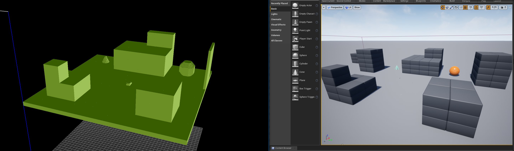
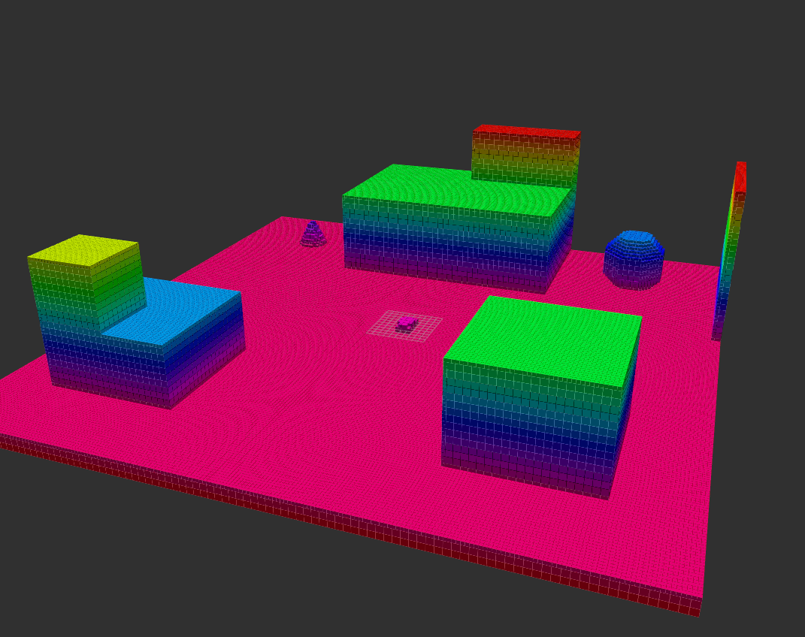

AirSim 提供了一项功能，可以直接从 Unreal Engine 构建世界的真实体素网格。体素网格是对给定世界/地图的占用情况的表示，通过离散化为一定大小的单元格；如果某个特定位置被占用，则记录一个体素。

构建体素网格的逻辑在 `WorldSimApi.cpp->createVoxelGrid()` 中。目前的假设是体素网格是一个立方体——从 Python 的 API 调用结构如下：

```
simCreateVoxelGrid(self, position, x, y, z, res, of)
```

- position (Vector3r): 体素网格中心的全球位置，单位为米
- x, y, z (float): 每个体素网格维度的大小，单位为米
- res (float): 体素网格的分辨率，单位为米
- of (str): 要保存体素网格的输出文件名

在 `createVoxelGrid()` 中，返回占用情况的主要 Unreal Engine 函数是 [OverlapBlockingTestByChannel](https://docs.unrealengine.com/en-US/API/Runtime/Engine/Engine/UWorld/OverlapBlockingTestByChannel/index.html)。

```
OverlapBlockingTestByChannel(position, rotation, ECollisionChannel, FCollisionShape, params);
```

该函数在我们希望分离地图的所有“单元格”的位置上被调用，返回的占用结果被收集到数组 `voxel_grid_` 中。单元格占用值的索引遵循 [binvox](https://www.patrickmin.com/binvox/binvox.html) 格式的约定。

```
for (float i = 0; i < ncells_x; i++) {
    for (float k = 0; k < ncells_z; k++) {
        for (float j = 0; j < ncells_y; j++) {
            int idx = i + ncells_x * (k + ncells_z * j);
            FVector position = FVector((i - ncells_x /2) * scale_cm, (j - ncells_y /2) * scale_cm, (k - ncells_z /2) * scale_cm) + position_in_UE_frame;
            voxel_grid_[idx] = simmode_->GetWorld()->OverlapBlockingTestByChannel(position, FQuat::Identity, ECollisionChannel::ECC_Pawn, FCollisionShape::MakeBox(FVector(scale_cm /2)), params);
        }
    }
}
```

地图的占用情况是逐个离散化的单元格迭代计算的，这可能会是一个密集的操作，具体取决于单元格的分辨率和被测量区域的总大小。如果用户感兴趣的地图变化不大，可以对该地图运行一次体素网格操作，并保存体素网格以供重用。为了性能，或在动态环境中，我们建议对机器人周围的小区域运行体素网格生成；随后将其用于本地规划目的。

体素网格以 binvox 格式存储，用户可以将其转换为 octomap .bt 或其他任何相关的所需格式。随后，这些体素网格/octomaps 可以在映射/规划中使用。一个用于可视化创建的 binvox 文件的小工具是 [viewvox](https://www.patrickmin.com/viewvox/)。类似地，`binvox2bt` 可以将 binvox 转换为 octomap 文件。

##### 示例体素网格在 Blocks 中：


##### 转换为 Octomap 格式的 Blocks 体素网格（在 rviz 中可视化）：


作为示例，一旦 Blocks 环境启动并运行，可以如下构建体素网格：

```
import airsim
c = airsim.VehicleClient()
center = airsim.Vector3r(0, 0, 0)
output_path = os.path.join(os.getcwd(), "map.binvox")
c.simCreateVoxelGrid(center, 100, 100, 100, 0.5, output_path)
```

并通过 `viewvox map.binvox` 进行可视化。