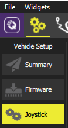

# XBox 控制器

要在 AirSim 中使用 XBox 控制器，请按照以下步骤操作：

1. 连接 XBox 控制器，以便它在您的 PC 游戏控制器中显示：


2. 启动 QGroundControl，您应该会在设置中看到一个新的操纵杆选项卡：



现在标定无线电，并设置一些方便的按钮操作。例如，我将我的设置为：'A' 按钮用于开启无人机，'B' 切换到手动飞行模式，'X' 切换到高度保持模式，'Y' 切换到位置保持模式。我还更喜欢在标记为“在滚转、俯仰、偏航上使用指数曲线”的框中打勾，因为这给我在小幅移动时提供了更大的灵敏度。

QGroundControl 将通过 MavLinkTest 上面设置的 UDP 代理端口 14550 找到您的 Pixhawk。AirSim 将通过上面设置的另一个 UDP 服务器端口 14570 找到您的 Pixhawk。此时，您也可以使用所有 QGroundControl 控件进行自主飞行。

3. 使用 MavLinkTest.exe 连接到 Pixhawk 串口，如下所示：
```
MavLinkTest.exe -serial:*,115200 -proxy:127.0.0.1:14550 -server:127.0.0.1:14570
```

4. 使用以下 `~/Documents/AirSim/settings.json` 设置运行 AirSim Unreal 模拟器：
```
"Vehicles": {
    "PX4": {
        "VehicleType": "PX4Multirotor",

        "SitlIp": "",
        "SitlPort": 14560,
        "UdpIp": "127.0.0.1",
        "UdpPort": 14570,
        "UseSerial": false
    }
}
```

## 高级

如果 QGroundControl 中没有显示操纵杆选项卡，请单击工具栏左侧的紫色 "Q" 图标以显示首选项面板。转到常规选项卡并检查虚拟操纵杆复选框。返回设置屏幕（齿轮图标），单击参数选项卡，在搜索框中输入 `COM_RC_IN_MODE` 并将其值更改为 `Joystick/No RC Checks` 或 `Virtual RC by Joystick`。

### 其他选项

请参见 [远程控制器选项](remote_control.md)